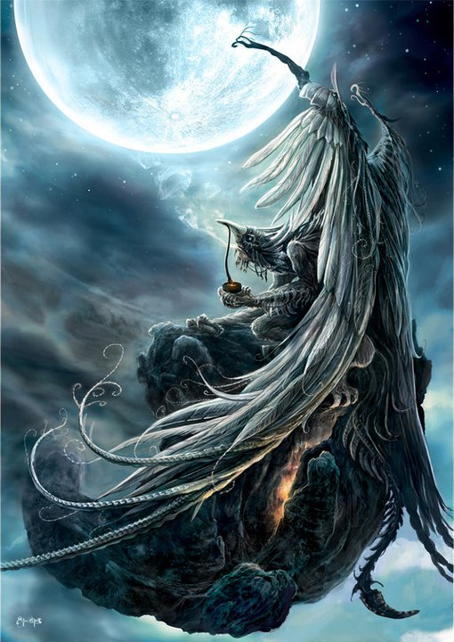

### Привет тем кто с приветом! 👋

За счёт методики симметриии здесь прорабатываются скилы родословной:

1. <b>родственники</b>
2. <b>близкие</b> (муж-жена, дети)
3. <b>коллеги</b> (у лялек они тоже есть)
4. <b>друзья</b>

и их корней для избавления от претензий мира к вам.

### Ниже результат моих исследований 👇

<b>1. Скил оптимальности: особенность <a target="_blank" href="https://www.youtube.com/watch?v=y_Tfj7MyRts">🎒</a></b>
   - [X] <a href="https://github.com/botogame/botogame/blob/main/freedom/distribution/fracture/README.md">`Тетрадь Смерти: Перелом`</a> [пограничный мир]
   - [ ] <a href="https://github.com/botogame/botogame/blob/main/freedom/distribution/circuit_coder/README.md">Квантовое Мышление. Схемокодер</a> [перспективный исходник]
   - [X] <a href="https://github.com/botogame/botogame/blob/main/freedom/distribution/business_code/README.md">Бизнес код</a>
   - [X] <a href="https://github.com/botogame/botogame/blob/main/freedom/distribution/resonance_code_constructor/README.md">Конструктор резонансного кода</a>
   - [X] <a href="https://github.com/botogame/botogame/blob/main/freedom/distribution/resonant_code/README.md">Резонансный код</a>
   - [X] <a href="https://github.com/botogame/botogame/blob/main/freedom/distribution/centered_site/README.md">Центрированный сайт</a>

<b>2. Скил практичности: комплектация <a target="_blank" href="https://www.youtube.com/watch?v=CtgPzcN6HP0">👛</a></b>

   - [ ]  [важная практика] 
   - [X] <a href="https://github.com/botogame/botogame/blob/main/freedom/order/portable_food/README.md">Портативная еда</a>
   - [X] <a href="https://github.com/botogame/botogame/blob/main/freedom/order/maze_game/README.md">Игра лабиринт</a>
   
<b>3. Скил деликатности: взаимодействие <a target="_blank" href="https://m.youtube.com/watch?v=PCOXZqw3ST0">🃏</a></b>
   - [X] <a target="_blank" href="https://github.com/botogame/botogame/blob/main/freedom/interaction/vigil/README.md">`Пасьянс Медичи. Бдилка`</a> [изменчивый мир]
   - [X] <a href="https://github.com/botogame/botogame/blob/main/freedom/interaction/creating_privileges/README.md">Создание привилегий</a>
   - [X] <a href="https://github.com/botogame/botogame/blob/main/freedom/interaction/talent_catalyst/README.md">Катализатор талантов</a>
   - [X] <a href="https://github.com/botogame/botogame/blob/main/freedom/interaction/education_individuality/README.md">Образование индивидуальности</a>
   - [X] <a href="https://github.com/botogame/botogame/blob/main/freedom/interaction/other_knowledge/README.md">Иное познание</a>

<b>4. Скил эффективности: распределение <a target="_blank" href="https://www.youtube.com/watch?v=AKO5r0QJO-w">🔪</a></b>

   - [ ] [конечная инстанция] 
   - [X] <a href="https://github.com/botogame/botogame/blob/main/freedom/uniqueness/different_understanding_capitalism/README.md">Иное понимание капитализма</a>
   - [X] <a href="https://github.com/botogame/botogame/blob/main/freedom/uniqueness/planning_basics/README.md">Основы планирования</a>

Проекты с галочкой означают что проекты были доведены до целостного формата "выживание" (50 на 50 верно). Но это не конец, доработка может вестить и дальше. С `выделением` означает что проект достиг формата "жизнь". В квадратных скобах то, что получается на выходе.
