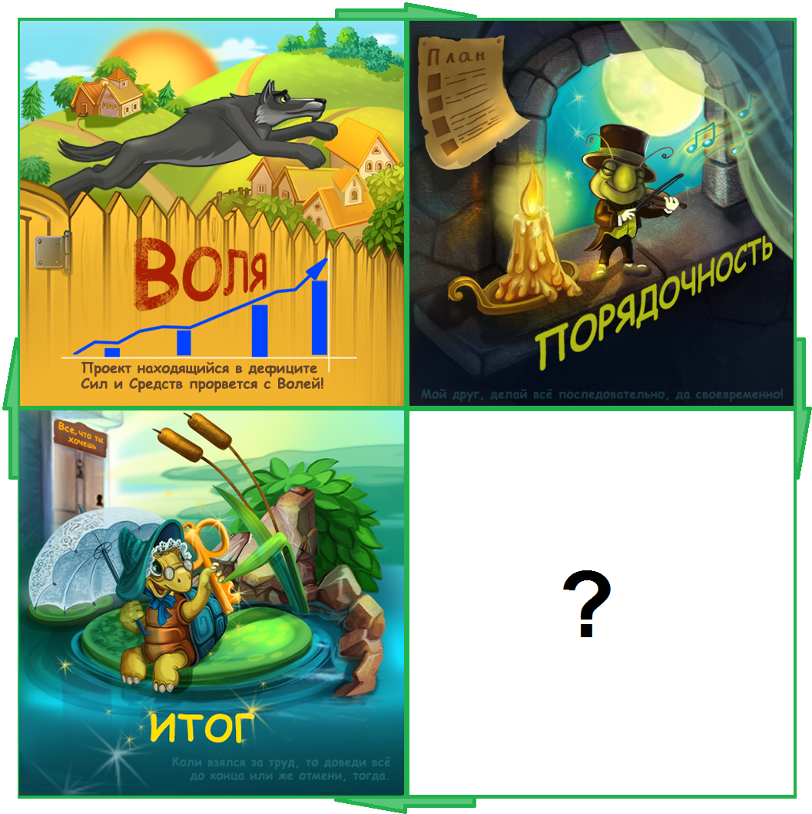

### Привет 👋

С 2017 года я занимаюсь разработкой человеческого генотипа "благополучие". 

> А так же я занимаюсь <a href="https://www.fl.ru/users/botogame/">фрилансом</a> на php.

> В течении 2017-2021 годов в городах Южно-Сахалинск, Санкт-Петербург, Москва и Нижний Новгород разрабатывались проекты "благополучия".

Работа:
1. <a href="https://github.com/dominic-of-russia/code.well-being">Типизированная ddd</a>
   - <a href="https://github.com/dominic-of-russia/code.well-being/blob/main/Прототипы/Центрированный%20сайт">Центрированный сайт</a>
   - <a href="https://github.com/dominic-of-russia/code.well-being/blob/main/Прототипы/Резонансный%20код">Резонансный код</a>
   - <a href="https://github.com/dominic-of-russia/code.well-being/blob/main/Прототипы/Внешний%20вид%20программы">Программа разработки</a>
2. <a href="https://github.com/dominic-of-russia/yii2.well-being">Конструктор yii2</a>

Прокачка:
1. <a href="https://github.com/dominic-of-russia/game.well-being">Игра лабиринт</a>
2. IT бизнес / <a href="https://github.com/dominic-of-russia/investing.well-being/">скоро</a>

Смысл жизни:
1. <a href="https://github.com/dominic-of-russia/cradle.well-being">Таланты и привилегии</a>
   - <a href="https://github.com/dominic-of-russia/cradle.well-being/blob/main/Размышления">Подмечание особенностей</a>
2. Портативная еда / <a href="https://github.com/dominic-of-russia/requirement.well-being">скоро</a>
