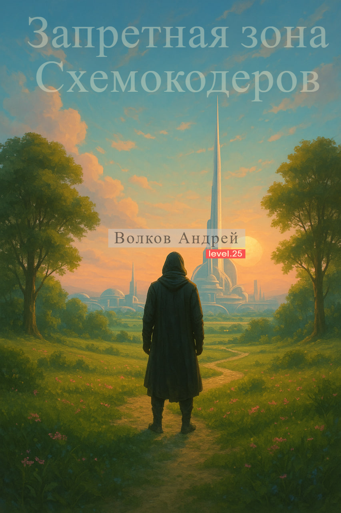

# Программирование 

## Проект "Запретная зона схемокодеров"

На заре цифровой эры, когда первые байты падали на землю подобно дождю, появился Схемокодер. Подобно мастерам боевых духов, каждый начинающий кодер должен был выбрать свой путь: слабые гибли в пустынных скриптах, другие навыки застревали в проклятом Notepad 6.66, где строки ломали разум, а отступы рвали душу.

Но истинные программисты кода знали: каждый модуль — это скилл, каждая библиотека — кольцо силы, которое нужно обуздать. Кто смог соединить их гармонией — поднимался выше, приближаясь к нему, первому Схемокодеру.



Сейчас мы опираемся на Notepad версии 6.66 — темную, минималистичную среду, где строки кода втягиваются в классы, которые могут в дальнейшем стать неучтённой частью кода. Каждый класс — это отдельная сущность, но их количество растёт, и уже ощущается квантовая запутанность, когда взаимодействие между ними становится громоздно-непредсказуемым, а взаимоотношения с Источником Задания — более отдалённо-непонимаем.

В такой среде накопление неучтённых деталей из ранее поставленной задачи способно превратить дело до невозможности довести его до конца, оставляя код как недостроенный бастион, который проще оставить позади, чем пытаться завершить.

Но впереди нас ждёт прекрасная среда программирования — светлый и упорядоченный код, где каждая его часть взаимодействует с другими чисто и предсказуемо. В этой среде наши герои будут полностью реализовывать свои силы, умения будут комбинироваться без хаоса, а код станет живым и понятным.

Это путешествие из темного Notepad 6.66 в идеальную среду, где магия классов растворяется во всем своём прекрасном.

-----------------------------------------------------------

Опробован первый прототип построения html страницы: <a href="https://botogame.ru/circuit-coder/">https://botogame.ru/circuit-coder/</a>.

Видеопрезентация прототипа: <a href="https://www.youtube.com/@circuit-coder" target="_blank">youtube @circuit-coder</a>

Группа в телеграмме для обсуждения нового витка программирования <a href="https://t.me/botogame_ru_zone">https://t.me/botogame_ru_zone</a>


```
