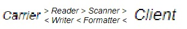
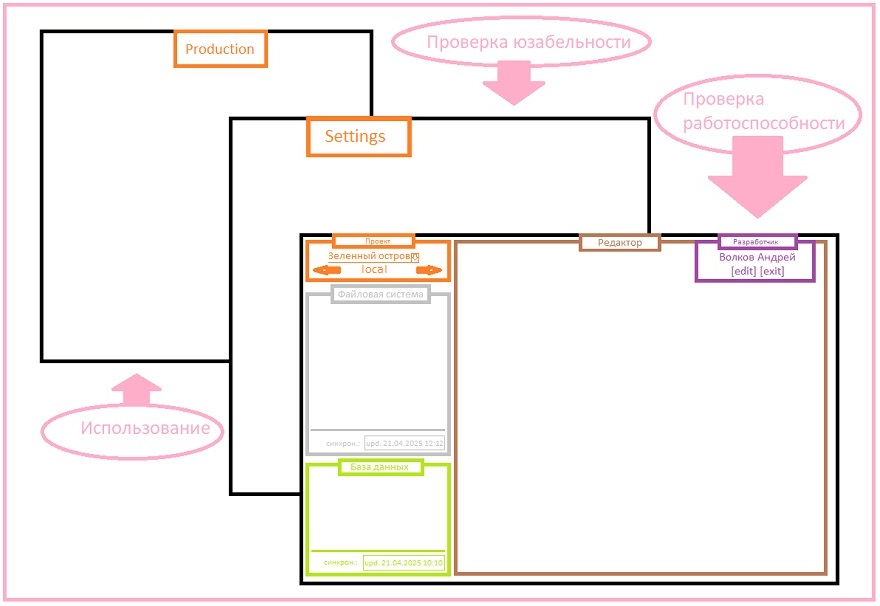
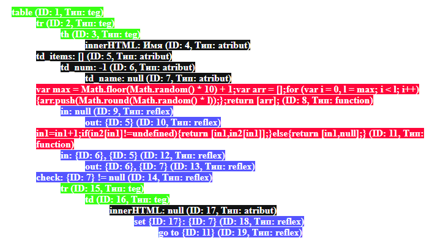
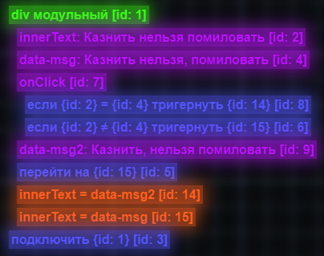
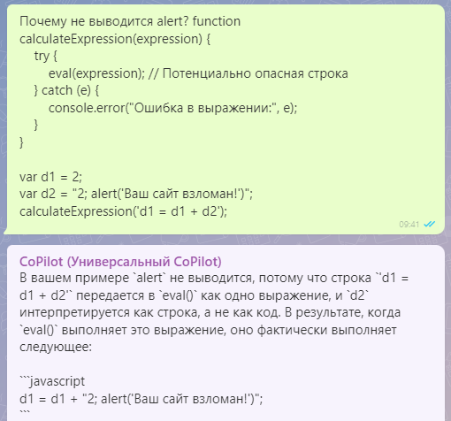

# Скил оптимальности: распределение 

## Проект "Квантовое Мышление. Схемокодер"

Онлайн схемокодер реализовывается здесь: <a href="https://botogame.github.io/circuit-coder/">https://botogame.github.io/circuit-coder/</a>.

Пример составления html тэгов с вытавлением "class": <a href="https://www.youtube.com/watch?v=oW7JlXuVCf0" target="_blank">видос на ютуб</a>

Подписывайтесь на <a href="https://www.youtube.com/@circuit-coder">ютуб канал</a>

### Начало

Создавая оболочку для бизнес кода я буду придержится анти-принципа грандиозности "заменимых не существует": 

1. никаких bild-версий / каждый файл меняется отдельно (в последовательности) наживую
2. меню будет и статичным и динамичным одновременно
3. новые файлы будут частью конструктора / картинки и pdf только через конструктор
4. права доступа / разработку можно залочить для паралельного участника


Задача перед средой разработки поставлю так: ресурсы как продолжение логики, процессы как продолжение конструкции.

Выделим их главные функции:

- упрощение в виде ресурсов продолжающие логику (практиковался на <a href="https://github.com/botogame/programming.prudence/blob/main/%D0%9F%D1%80%D0%BE%D1%82%D0%BE%D1%82%D0%B8%D0%BF%D1%8B/%D0%A6%D0%B5%D0%BD%D1%82%D1%80%D0%B8%D1%80%D0%BE%D0%B2%D0%B0%D0%BD%D0%BD%D1%8B%D0%B9%20%D1%81%D0%B0%D0%B9%D1%82/README.md">центрированном сайте</a>, есть прототипы)
- сбережение в виде процессов продолжающие конструкции (практиковался на <a href="https://github.com/botogame/programming.prudence/blob/main/%D0%9F%D1%80%D0%BE%D1%82%D0%BE%D1%82%D0%B8%D0%BF%D1%8B/%D0%A0%D0%B5%D0%B7%D0%BE%D0%BD%D0%B0%D0%BD%D1%81%D0%BD%D1%8B%D0%B9%20%D0%BA%D0%BE%D0%B4/README.md">резонансном коде</a>, есть прототипы)

Итогом должна образоваться среда разработки: ассертивный редактор (assertive_editor.exe).

Энергетику ассертивности хорошо показал Julien Doré в клипе <a href="https://www.youtube.com/watch?v=PtLPKvK4jv8&list=RDEMarcVqr-c-Xn4Wqnoz88aVw&index=2">Chou wasabi</a>: 


Ассертивность выстраивается на понимании. И в интернете про ассертивность иногда написано что нужно избавляться от паранойи, отнюдь не надо, а наоборот, эта необычная часть человеческого понимания о мире хорошо будет дополнять <a href="https://www.youtube.com/watch?v=KDXOzr0GoA4&list=RDEMarcVqr-c-Xn4Wqnoz88aVw&index=4">общую картину</a> редактора. Как и другие качества, которые вы не смогли проявить в других средах разработки.

<hr>

<h3>Этап 1. Код на уровне файлов</h3>

Сделаем расположение на главной редактора кода только таких корневых конструкций:

- файловое хранилище
- html {5.3}
- php {7.2}
- javascript {1.8.5}
- css {3}
- mysql {5.7}

Здесь "файловое хранилище" как старый способ разработки, и туда, помимо картинок, будем объявлять выгрузку сформированных данных с "html", "php" в указанные файлы index.php, /shablons/main.html, style.css и т.п. Таким образом будут реально <a href="https://youtu.be/0J1fKBxK9Wc?t=101">скованные одной цепью</a>.

Изучаю Carrier Rider Mapper... 



Наверно буду первым кто грамотно это спроектирует для редактировании кода, наверно. 

Если по CRM зайти в редактор, то скорее всего нужно увидеть такую структуру файлов:

```
/📁site/📄index.php
       /📁index.php/📄main.html
                   /📁main.html/📄style.css
                   /📁main.html/📄favicon.png
                   /📁main.html/📄logotype.png
       /📁index.php/📄about.php
                   /📁about.php/📄body.html
       /📁index.php/📄news.php
                   /📁news.php/📄body.html
                   /📁news.php/📄table.html
                   /📁news.php/📄table_td.html
                   /📁news.php/📄script.js
                   /📁news.php/📄data.sql
```

А внутри каждого файла сплетение бизнес кода с корневыми конструкциями php, html, js, css, mysql и т.д..

Если вспомнить про MVC, то на файлах скорее всего будет так:

```
/📁site/📄.htaccess
       /📁.htaccess/📄index.php
                   /📁index.php/📄main.html
```
Где, 
1. Controller: 📄.htaccess
2. Model: 📄index.php
3. View: 📄main.html

Ещё бы в корень добавить 📄.gitignore чтобы отделить статику от динамики например для динамичного json файла:

```
/📁site/📄.gitignore
       /📁.gitignore/📄parsed_list.json
/📁site/📄.htaccess
       /📁.htaccess/📄index.php
                   /📁index.php/📄main.html
```

Рандомные файлы, которые будут генерироваться, фиксируем с помощью папки, добавляя {id}:

```
/📁site/📄.gitignore
       /📁.gitignore/📁upload_portfolio_{id}.pdf/📄.gitkeep
```

Данные редактора будет вносить в файл 📄.project по типу csv:

```
/📁site.ru/📄.project
/📁site.ru/📄.htaccess
          /📁.htaccess/📄index.php
                      /📁index.php/📄main.html
/📁site.ru/📄.gitignore
          /📁.gitignore/📁upload_portfolio_{id}.pdf/📄.gitkeep
```

Идею первичности php перед html можно изменить:

```
/📁site.ru/📄.htaccess
          /📁.htaccess/📄index.html
                      /📁index.html/📄get_content.js
                      /📁index.html/📄wait_main_request.php
```

Для гита мониторинг базы данных будет только за таблицами и системнымм даннымм:

```
/📁site.ru/📄.htaccess
          /📁.htaccess/📄таблицы.sql
```

За папки отвечает процессы, а за файлы логика.

Если соотнести бизнес код, то:
1. папка несёт в себе название и тип, где за папкой закреплен обработчик входящих и выходящих данных.
2. файл несёт в себе так же название и тип, где за файлом закреплена связь откуда и куда поступать данным.

Вложенность папок составляется за счёт необходимости применения конструкции в родительской конструкции. Например в таблицу нужно добавить системеные данные:

```
/📁site.ru/📄.htaccess
          /📁.htaccess/📄таблицы.sql
                      /📁таблицы.sql/📄системные_данные.csv
```

Или Javascript по ajax подгружает php:

```
/📁site.ru/📄.htaccess
          /📁.htaccess/📄index.html
                      /📁index.html/📄pages_load.js
                                   /📁pages_load.js/📄core.php
```

Гитигноры тогда нужно вмещать так:

```
/📁site/📄.htaccess
       /📁.htaccess/📄index.php
                   /📁index.php/📄.gitignore
                               /📁.gitignore/📄upload_portfolio_{id}.pdf
```

Ну если принять, что ресурс завязан на конструкции, то так:

```
/📄site.ru
/📁site.ru/📄.htaccess
          /📁.htaccess/📄index.php
                      /📁index.php/📄.gitignore
                                  /📁.gitignore/📄upload_portfolio_{id}.pdf
                                               /📁upload_portfolio_{id}.pdf
```

Информацию редактирования можно разнести по папкам в виде 📄.history:

```
/📁site.ru/📄.htaccess
          /📁.htaccess/📄.history
          /📁.htaccess/📄index.php
                      /📁index.php/📄.history
                      /📁index.php/📄.gitignore
                                  /📁.gitignore/📄.history
                                  /📁.gitignore/📄upload_portfolio_{id}.pdf
                                               /📁upload_portfolio_{id}.pdf/📄.history
```

Ограничений просмотра файлов-папок нет, для редактирования файлов (построение бизнес кода) можно ввести доступ по скилам (php-программист, html-л, css-ник и т.д.).

Определим врагов:
1. файлы могут быть дурными
2. папки могут быть бестолковыми

Чтобы исключить враждебность, введём разделение dev/prod разработки в сам редактор, и управление обновлением настроим посредством ftp и mysql, напрямую. Все настройки подключения будем записывать в файл вне корня сайта 📄site.ru.

```
/📄site.ru
/📁site.ru/📄.history
```

Теперь вольнодумные исследования завершены и выведем основу работы в редакторе:
1. выбираем тип конструкции
2. описываем её назначение
3. добавляем результат или тестовый пример

По первому пункту редактор загрузит соотвествующую конструкции форму. По второму пункту будет выбрано название или записано своё, описание и ключи-значения. По третьему можно загрузить бинарные файлы.

Итогом будет

```
/📄site.ru <-- mysql_local_host = localhost;
/📁site.ru/📄.history
/📁site.ru/📄.htaccess <-- RewriteRule ^(.*)$ /index.php?path=$1 [NC,L,QSA]
          /📁.htaccess/📄.history
          /📁.htaccess/📄index.php <-- процедурный код
                      /📁index.php/📄.gitignore <-- /.gitignore/upload_portfolio_???????????.pdf
                                  /📁.gitignore/📄.history
                      /📁index.php/📄main.tpl <-- smarty шаблон
                                  /📁main.tpl/📄.history
                                  /📁main.tpl/📄logotype.png <-- загрузили бинарный файл
                      /📁index.php/📄авторизация.sql <-- sql запросы
                                  /📁авторизация.sql/📄.history
                      /📁index.php/📄cart.php <-- процедурный код
                                  /📁cart.php/📄корзина.sql <-- sql запросы
                                             /📁корзина.sql/📄.history
```

Появление файлов в редакторе организовать по факту необходимости. Например при заполнении site.ru вы отметили использование .htaccess, только так он и появился, для чего то с соотвествующим названием для будущего заполнения.

Естественно нужно сделать из редактора такую взаимосвязь, чтобы можно было отследить что не используется (или в стадии разработки), например какая нибудь таблица была создана, а php ещё не взял в разработку.

<h3>Спецификация</h3>

От понятия дублей кода придётся избавиться, вместо неё введём доступность с помощью вложения. Если необходим функционал-данные какого то внешнего файла - инициазируем алиас в подпапку, для дальнешего использования в режиме чтения.

```
/📁index.php/📄cart.php <-- процедурный код
            /📁cart.php/📄корзина.sql <-- sql запросы
                       /📁корзина.sql/📄.history
/📁index.php/📄user.php <-- процедурный код
             /📁user.php/📁корзина.sql/📄.history <-- алиас на /📁index.php/📁cart.php/📁корзина.sql/📄.history
```

<h3>Как будем работать над таблицей</h3>

Например нужна таблица количества дней у месяцев по дням неделям:


Создаём 

```
/📄количества дней у месяцев по дням неделям.sql
/📁количества дней у месяцев по дням неделям.sql/📄.history
```

Далее в 📄.history с помощью редактора составляем код:

```
1.📁Конструкция "таблица"
  1.1.📄Ресурс "неделя"
      1.2.📁Конструкция "enum"
          1.2.1.📄Ресурс "январь"
                1.2.1.1.📁Конструкция "tinyint"
          1.2.2.📄Ресурс "февраль"
                1.2.2.1.📁Конструкция "tinyint"
          1.2.3.📄Ресурс "март"
                1.2.3.1.📁Конструкция "tinyint"
```

Запрос данных будет выглядить так:

```
1.1.📄Ресурс "неделя" = "вторник" / уходит в условие where
1.2.1.📄Ресурс "январь" = false / отсюда данные не нужны
1.2.2.📄Ресурс "февраль" = true / ожидаем отсюда данные

1.📁Конструкция "таблица" = request select / берём данные
1.2.2.1.📁Конструкция "tinyint" = sort asc / сортируем начиная с малого числа
```

Результат:

```
1.📁Конструкция "таблица" = answer array / получить результат в виде массива
```

или так:

```
1.0.[📁>]Процесс "request select"
  1.0.1.[📄]Логика "установить значение" = "неделя" = "вторник" / уходит в условие where
  1.0.2.[📄]Логика "установить значение" = "январь" = false / сюда данные не нужны
  1.0.3.[📄]Логика "установить значение" = "февраль" = true / ожидаем сюда данные
        1.0.3.1.[<📁]Конструкция "tinyint" = sort asc / сортируем начиная с малого числа
                1.0.3.1.1.[📄]Ресурс "данные какого то дня"
```

<hr>

<h3>Код на уровне модульности</h3>

Введём символизм:
1. 🎁 Конструкции
2. ⚙️ Процесс
3. 🔐 Логика
4. 📷 Ресурсы

Построим небольшую программку:

```
🎁 ядро
   📷 запрос на _get
        🔐 {установить значение} "do"
   ⚙️ получить с _get
   📷 результат с _get
   🎁 реакция
        🔐 {для} "📷 результат с _get" {если равен} "start"
               📷 текст для echo
                      🔐 {установить значение} "Привет мир!"
               ⚙️ вывести текст
        🔐 {для} "📷 результат с _get" {если равен} "exit"
               ⚙️ остановить скрипт
   🎁 остановка
        🔐 {для} "📷 результат с _get" {установить значение} "exit"
        📷 позиция конструкции
               🔐 {установить значение} "🎁 реакция"
        ⚙️ запустить конструкцию
```

Последовательность:
1. авто-запускается конструкция `🎁 ядро`
2. берётся значение с $_GET['do']: функция `⚙️ получить с _get` по значению `📷 запрос на _get` отдала результат в `📷 результат с _get`
3. запускается внутренняя конструкция `🎁 реакция`
4. выполняется условие: в нашем случае выполнится `⚙️ вывести текст` т.к. мы запустили скрипт с запросом ?do=start
5. так как в конструкции `🎁 реакция` всё, у конструкции `🎁 ядро` запускается следующая внутрення конструкция `🎁 остановка`
6. изменяем значение `📷 результат с _get`  на 'exit'
7. повторно запускаем конструкцию `🎁 реакция`
8. здесь срабатывает условие на exit, но даже если условия такого и не было, то после отработки запуска конструкции `🎁 остановка` не последовало бы (но отработались бы все конструкции что были бы внутри)

Сделаем так, чтобы `📷 ресурсы` и `⚙️ процессы` уже были полностью проработаны редактором, где выбирая `⚙️ процессы` подгружаем перед-после нужные `📷 ресурсы` (перед - то что подгружаются в `⚙️ процесс`, после - то что выгружается). Добавить `📷 ресурс` (и изменить название) запретим, только авто-подгрузка с добавленным `⚙️ процессом`.

По ходу работы, `🎁 конструкции` будут означать для вас как варианты, а `📷 ресурсы` будете использовать как фильтры. Попробуем построить запрос к таблице:

```
🎁 авторизованный пользователь
   📷 таблица запроса
        🔐 {установить значение} "users"
   📷 получить поля
        🔐 {установить в массив значение} "id"
        🔐 {установить в массив значение} "name"
        🔐 {установить в массив значение} "email"
   📷 условия отбора
        🔐 {установить в массив условие} "id" {=} "1"
   📷 позиция взятия
        🔐 {установить значение} {false}
   📷 количество
        🔐 {установить значение} "1"
   ⚙️ загрузить с таблицы
   📷 результат
```

Естественно мы должны в начале объявить о таблице:

```
🎁 таблица пользователей
   📷 название таблицы
        🔐 {установить значение} "users"
   📷 поля
        🔐 {установить в массив ключ-значение} "id" {=} "int"
        🔐 {установить в массив значение} "name" {=} "varchar 100"
        🔐 {установить в массив значение} "email" {=} "varchar 254"
        🔐 {установить в массив значение} "active" {=} "boolean not null"
   📷 первичный ключ
        🔐 {установить значение} "id"
   ⚙️ объявить таблицу
   📷 результат
```

И получим данные уже с неё:

```
🎁 авторизованный пользователь
   📷 таблица запроса
        🔐 {установить значение} "🎁 таблица пользователей / 📷 название таблицы"
   📷 получить поля
        🔐 {установить в массив значение} "🎁 таблица пользователей / 📷 поля / id"
        🔐 {установить в массив значение} "🎁 таблица пользователей / 📷 поля / name"
        🔐 {установить в массив значение} "🎁 таблица пользователей / 📷 поля / email"
   📷 условия отбора
        🔐 {установить в массив условие} "🎁 таблица пользователей / 📷 поля / id" {=} "1"
   📷 позиция взятия
        🔐 {установить значение} {false}
   📷 количество
        🔐 {установить значение} "1"
   ⚙️ загрузить с таблицы
   📷 результат
```

Соотвественно у каждой `🎁 конструкции` будет какой то готовый набор возможного применения `⚙️ процессов`. А для `📷 ресурсов` свои `🔐 логики`. Всё статично должно завиксировано в редакторе, который в дальнейшем автоматически соберёт код.

Так мы будем выстраивать <a target="_blank" href="https://github.com/botogame/programming.prudence/blob/main/%D0%9F%D1%80%D0%BE%D1%82%D0%BE%D1%82%D0%B8%D0%BF%D1%8B/%D0%A0%D0%B5%D0%B7%D0%BE%D0%BD%D0%B0%D0%BD%D1%81%D0%BD%D1%8B%D0%B9%20%D0%BA%D0%BE%D0%B4/README.md">резонансный код</a>.

<hr>

<h3>Код на уровне версионности</h3>

Чтобы не путаться в подобных цифрах - `31.0.2.1.212312.12332131232` будет закреплять модификации задачами проектов (`магазин / корзина`, `пользователи / фикс вывода #2`). Так мы сможем ввести загрузку на dev и prod только нужных модификаций. Единственно нужно обдумать как быть с теми конструкциями, которые были изменены по двум задачам (табу на ведение двух задач в смежных конструкций?).

Вначале будет первый проект `подготовка среды разработки` где задачей будет `настройка`, далее `подготовка среды разработки / навигация` и т.д. (`подготовка среды разработки / модули`, `подготовка среды разработки / тестирование`). Возможно можно будет по пути зафиксировать галочками "можно | нельзя изменять  другими задачами (проектами)".

Если хорошо подумать, то скорее каждый модуль нужно привести к такому изначальному проектированию:
1. настройка  - аккаунты, таблицы
2. контроль - определение места запуска, подключение к базе данных, ввод данных, стопперы, заглушки
3. реакции - обработка и вывод данных
4. модули - функциональные программы (настройка+контроль+реакции)

Или даже так (если следовать этапам разработки):

1. реакции
2. модули
3. контроль
4. настройки

Общими словами будет так:

1. программа
     - 1.1. задачи
     - 1.2. решения
     - 1.3. связи
     - 1.4. информация

Где отвественность:
1. целостность
     - 1.1. выполнение
     - 1.2. дополнение
     - 1.3. фиксация
     - 1.4. организация

Для свободной переделки текущего проекта в модуль, введём возможножность соотносительную замену `⚙️ процессов` + `📷 ресурсы`, чтобы например можно быстро подменить  `⚙️ получить с _get` на `⚙️ получить с _global` без потери логической цепочки и выполнения функциональности.

Автозапуск по итогу должен проходить по папкам 1.4. => 1.3. => 1.2. => 1.1. ( при этом автозапуск на модули 1.2. не применяется, их можно вызвать только  `⚙️ запустить модуль`, где переменные ввода будут из 1.4. из этого модуля).

<hr>

<h3>Код на уровне реализации</h3>

У программы (сайта) будет четыре стадии:

1. local - сборочная версия на локалке
2. developer - редактируемый код по новым правилам
3. settings - сборочная версия для настройки на сервере
4. production - сборочная версия для использования на сервере

`Local` версия собирается по факту работы `Developer`. На `Settings` можно отправить определённые конструкции (их изменение). На `Production` протолкнуть то, что было протолкнуто в `Settings`.

При этом, при разработке:
- в `🎁 конструкциях` очередность выполнения `⚙️ процессов` на первом месте
- `📷 ресурсам` можно добавить описание, и при установке значения `🔐 логикой`, выводить вместо названия

Уровни доступа и права доступа теперь переходят в такие области (которые управляемы/иницируемы `⚙️ процессами`):
1. $_GET
2. $_POST
3. $_SERVER
4. $_COOKIE
5. $_SESSION
6. $_GLOBALS

<hr>

<h3>Стэк работы</h3>



Модель программирования примерно будет такая:

```
📁programm
    📁public
        📄index.php
    📁core
        📁modules
            📄RouterClass.php
        📁services
            📄ComparisonYearsService.php
```
Код замкнут на index.php. В RouterClass.php храняться старые наработки-опыт с предыдущих проектов, а ComparisonYearsService.php новые, необходимые только для проекта (с подстройкой). Конфигурации проекта хранятся как в modules, там и в services.

<details>
<summary><ins>Содержимое index.php</ins></summary>

```php
<?php 

require __DIR__ . '/../core/modules/RouterClass.php';
require __DIR__ . '/../core/services/ComparisonYearsService.php';

$router = new RouterClass();
echo $router->run_request_service();

?>
```
</details>

Паблик инклудит все классы и запускает центровой класс с инициирущей программу функцией.
       
<details>
<summary><ins>Содержимое RouterClass.php</ins></summary>
       
```php
<?php

class RouterClass {

    var $services = ['comparison_years' => 'ComparisonYearsService'];
    var $token = '1234';

    /* Формирование ответа на return */
    public function formited_answer($answer, $text) {
        if (!in_array($answer, ['error', 'result', 'request'])) {
            $answer = 'unknown';
        }

        $result = ['answer' => $answer, 'text' => $text];

        return $result;
    }

    /* Подключение сервиса */
    public function run_request_service() {
        $service_request = $this->get_service_request();

        if ($service_request['answer'] != 'result') {
            $this->set_service_answer($service_request);
        } else {
            $check_token = $this->check_token();

            if ($check_token['answer'] != 'result') {
                $this->set_service_answer($check_token);
            } else {
                $service = new $service_request['text']();
                $service_answer = $service->run();

                $this->set_service_answer($service_answer);
            }
        }
    }

    /* Отвечаем */
    public function set_service_answer($answer) {
        // echo json_encode($array);
        // echo print_r($answer, true);

        if ($answer['answer'] == 'result') {
            echo 'Количество заказов за ' . $answer['text']['date'] . ': ' . $answer['text']['metrica_orders'] . ' штук это на <b>' . intval($answer['text']['merge_per_orders']) . '</b>% ' . (($answer['text']['merge_per_orders'] > 0) ? ' больше' : ' меньше') . ' чем в том году<br>
Выручка: ' . number_format($answer['text']['metrica_revenue'], 0, ',', ' ') . ' это на <b>' . intval($answer['text']['merge_per_revenue']) . '</b>% ' . (($answer['text']['merge_per_revenue'] > 0) ? ' больше' : ' меньше') . ' чем в том году';
        } elseif ($answer['answer'] == 'request' && ($answer['text'] == 'null_token' || $answer['text'] == 'bad_token')) {
            echo 'не правильный токен';
        } elseif ($answer['answer'] == 'request' && ($answer['text'] == 'null_date' || $answer['text'] == 'bad_date')) {
            echo 'не правильный формат getinfo (дд.мм.гг)';
        } else {
            echo 'не правильный запрос';
        }

        die;
    }

    /* Получаем сервис запроса */
    public function get_service_request() {
        $service_request = @$_GET['service'];
        if ($service_request == '') {
            return $this->formited_answer('request', 'null_service');
        }

        if (!isset($this->services[$service_request])) {
            return $this->formited_answer('request', 'bad_service');
        }

        return $this->formited_answer('result', $this->services[$service_request]);
    }

    /* Проверяем токен */
    public function check_token() {
        $token = @$_GET['token'];

        if ($token == '') {
            return $this->formited_answer('request', 'null_token');
        }

        if ($token != $this->token) {
            return $this->formited_answer('request', 'bad_token');
        }

        return $this->formited_answer('result', true);
    }
}

?>
```

</details>

Модули помогают создавать формат работы над сервисами.
       
<details>
<summary><ins>Содержимое ComparisonYearsService.php</ins></summary>

```php
<?php 

class ComparisonYearsService extends RouterClass {

    /* Выполняется во время работы */
    public function run() {
        $date_request = $this->get_date_request();

        if ($date_request['answer'] != 'result') {
            return $date_request;
        } else {
            $metrica_last_year = ['orders' => 500, 'revenue' => 800000];
            $metrica_this_year = ['orders' => 1600, 'revenue' => 4050000];

            $date_merge = [
                'date' => $date_request['text'],
                'metrica_orders' => $metrica_this_year['orders'],
                'metrica_revenue' => $metrica_this_year['revenue'],
                'merge_per_orders' => (ceil(($metrica_this_year['orders'] * 100) / $metrica_last_year['orders']) - 100),
                'merge_per_revenue' => (ceil(($metrica_this_year['revenue'] * 100) / $metrica_last_year['revenue']) - 100),
            ];

            return $this->formited_answer('result', $date_merge);
        }
    }

    /* Получаем дату запроса */
    public function get_date_request() {
        $date_request = @$_GET['getinfo'];
        if ($date_request == '') {
            return $this->formited_answer('request', 'null_date');
        }

        if (!preg_match('/([0-9]{1,2})\.([0-9]{1,2})\.([0-9]{4})/', $date_request, $date_request_arr) || $date_request_arr[2] > 12) {
            return $this->formited_answer('request', 'bad_date');
        }

        $date_request = date('d.m.Y', strtotime($date_request_arr[0]));

        return $this->formited_answer('result', $date_request);
    }
}

?>
```
</details>

В итоге получается замкнутый api на файл /product-metrica/public/index.php с запросом: 
<b>?service=comparison_years&getinfo=10.10.2025&token=1234</b>


<h3>Фишка</h3>

Вышеописанный подход хорош на одном классе, со вторым классом вы уже столнётесь с тем, что какую то функцию нужно сделать общей, а где то нужно фиксануть проблему, где вы изменяя какую то функцию, багнули какой то другой функционал. А представьте что один разработчик создал отвлетление от ветки dev на какую то фичу, а другой разработчик от ветки dev этого же проекта создал отвлетление на какой то фикс. И вот настал момент слияния, первый разработчик замерджил правки с dev, протестировал, и отдал на мердж с продом, закрывая задачу. Второй разработчик намного дольше разобрался со своей задачей, при этом удалил функционал которым никто не пользовался, в общем тоже протестировал на dev и отдал на прод. По итогу через долгое время, первому разработчику меседж что его разработки не работают, так как второй разработчик потёр функционал, который первый разработчик случайно нашел и решил использовать. Вы конечно уже понял что нужны тесты, но увы, большинство задач требуют выполнения последовательности, которую другой разработчик может изменением нарушить, а тесты будут говорить "а эта функция так же отдаёт тот же результат по прямому запросу к ней", но увы, её вызывают раньше времени и она начинает уже работать по другому для чего то. Скажите создавайте классы и инициируйте и инициируйте, Но увы этого всего дофига. Нужна простота!

Так фишка бизнес кода в том чтобы она могла упорядочиваться. Фрилансеры может не поймут, а вот офисные знают что задачи иногда протеворечат предыдущим задачам, и очень трудно это выносить, и тем более программировать. Там вот, представьте, у вас появилась кнопка, по которой весь углубленный код растусуется по модулям, уровняется по уровням, со всем сохранением предыдущих задумок. Например какие то несколько функций юзали модуль, вы отсекли связи, оставив взаимодействие только на одном функционала, то модуль уйдёт внутрь этого функционала. Захотели заюзать вновь этот бывший модуль, создали связи и бывший модуль вновь стал общим модулем. Это демократично. Кого юзаешь тот и на виду. Естественно часть кода можно переместить куда угодно сохранив связи, например вам захотелось очистить обзор на иерархию, убрали лишнее в другое место, запрограммировали и нажали упорядочить - и вся иерархия встала на место. Это удобно, и позволяет проводить опыты без последствий. Например создали папку (с запретом выполнения, и отметкой что при упорядочивании вернулись на место) и закинули туда все компоненты определенной страницы, ну чтобы они не мешали отображения нового компонента, затестили его и убрали его в БФТ затерев в папке. Далее нажали кнопку упорядочивания и те компоненты что были заблочены с отметкой - вернулись на место. Так разработчик может концетрироваться на эксперементах, то есть результатах, получая их быстрее. 

<h3>Прототип #1</h3>

Соберём <a href="https://botogame.github.io/circuit-coder/" target="_blank">тестовым билдером</a> такую схему: 



<details>
<summary><ins>массив слепка</ins></summary>
       
```js
[
  {
    "id": 1,
    "name": "table",
    "type": "teg",
    "children": [
      {
        "id": 2,
        "name": "tr",
        "type": "teg",
        "children": [
          {
            "id": 3,
            "name": "th",
            "type": "teg",
            "children": [
              {
                "id": 4,
                "name": "innerHTML: Имя",
                "type": "atribut",
                "children": []
              }
            ]
          }
        ]
      },
      {
        "id": 5,
        "name": "td_items: []",
        "type": "atribut",
        "children": [
          {
            "id": 6,
            "name": "td_num: -1",
            "type": "atribut",
            "children": [
              {
                "id": 7,
                "name": "td_name: null",
                "type": "atribut",
                "children": []
              }
            ]
          }
        ]
      },
      {
        "id": 8,
        "name": "var max = Math.floor(Math.random() * 10) + 1;var arr = [];for (var i = 0, l = max; i < l; i++) {arr.push(Math.round(Math.random() * l));};return [arr];",
        "type": "function",
        "children": [
          {
            "id": 9,
            "name": "in: null",
            "type": "reflex",
            "children": [
              {
                "id": 10,
                "name": "out: {ID: 5}",
                "type": "reflex",
                "children": []
              }
            ]
          }
        ]
      },
      {
        "id": 11,
        "name": "in1=in1+1;if(in2[in1]!=undefined){return [in1,in2[in1]];}else{return [in1,null];}",
        "type": "function",
        "children": [
          {
            "id": 12,
            "name": "in: {ID: 6}, {ID: 5}",
            "type": "reflex",
            "children": [
              {
                "id": 13,
                "name": "out: {ID: 6}, {ID: 7}",
                "type": "reflex",
                "children": []
              }
            ]
          }
        ]
      },
      {
        "id": 14,
        "name": "check: {ID: 7} != null ",
        "type": "reflex",
        "children": [
          {
            "id": 15,
            "name": "tr",
            "type": "teg",
            "children": [
              {
                "id": 16,
                "name": "td",
                "type": "teg",
                "children": [
                  {
                    "id": 17,
                    "name": "innerHTML: null",
                    "type": "atribut",
                    "children": [
                      {
                        "id": 18,
                        "name": "set {ID: 17}: {ID: 7}",
                        "type": "reflex",
                        "children": [
                          {
                            "id": 19,
                            "name": "go to {ID: 11}",
                            "type": "reflex",
                            "children": []
                          }
                        ]
                      }
                    ]
                  }
                ]
              }
            ]
          }
        ]
      }
    ]
  }
]
```
</details>

Старый вариант написания кода:

```js
<table id="teg1">
    <tr id="teg2">
        <th id="teg3">
            <script>
                document.getElementById('teg3').innerHTML = 'Имя';
            </script>
        </td>
    </tr>
    <script>
        var td_items = [];
        var td_num = -1;
        var td_name = null;
        function function8(){
            var max = Math.floor(Math.random() * 10) + 1;
            var arr = [];
            for (var i = 0, l = max; i < l; i++) {
                arr.push(Math.round(Math.random() * l));
            };
            return [arr];
        }
        var out = function8();
        td_items = out[0];
        function function11(in1,in2){
            in1=in1+1;
            if(in2[in1]!=undefined){
                return [in1,in2[in1]];
            }
            else{
                return [in1,null];
            }
        }
        var reflex19num = 0;
        function reflex19(reflex19num){
            var out = function11(td_num,td_items);
            td_num = out[0];
            td_name = out[1];
            if(td_name!==null){
                var new_tag = document.createElement('tr');
                new_tag.id = 'teg15_'+reflex19num;
                document.getElementById('teg1').appendChild(new_tag);
                var new_tag = document.createElement('td');
                new_tag.id = 'teg16_'+reflex19num;
                document.getElementById('teg15_'+reflex19num).appendChild(new_tag);
                document.getElementById('teg16_'+reflex19num).innerHTML = td_name;
                reflex19num = reflex19num + 1;
                reflex19(reflex19num);
            }

        }
        reflex19(reflex19num);
    </script>
</table>
```
Нужно будет проработать ядро, которое реализуется так же, только уже для слепка схемы.


<h3>Разработка версии 2</h3>

Для версии 2 введем условия, события и функционал. В виде схемокода это предстанет так:



Где нужно проработать:

1. в атрибут можно добавить рефлекс, это ещё было в версии 1, но в версии 2 запретим автозапуск схемы внутри тэгов и добавим "отслеживание" (пока не изменение значений внутри схемы и события нажатия) когда будет какой то контакт (изменение) с атрибутом (уже после авто-запуска).
2. условия сделаем в виде рефлекса с запуском одного элемента: если {id: N} ~ {id: N} тригернуть {id: N}
3. варианты сравнения (~): > < = ≠ ≥ ≤ [и возможно т.д.]
4. события выставлять атрибутом, с обозначение события: onClick, disabled [и возможно т.д.]
5. в функционал вводить свободный процедурный код в виде одной команды, где переменные для использования заданы атрибутами тэга, в котором находится функционал

<h3>Прямое выполнение кода</h3>

Непонятно почему на слово EVAL наложено слово "опасность". Давайте поинтересумся, может был когда то век когда программистам не доверяли писать код в виде строки, и он пока не видел руководитель вводил туда опасное?

Представим, пришел начальник проверять на троянского коня:


У вас задача не ошибиться:

```js
function calculateExpression(expression) {
    try {
        eval(expression); // Потенциально опасная строка
    } catch (e) {
        console.error("Ошибка в выражении:", e);
    }
}
d1 = 1;
d2 = 5;
calculateExpression('d1 = d1 + d2');
```
Эта функция нужна, и вам без неё никуда... напряжение... пошёл анализ:



Пронесло. Опасность фиктивная. Серьезный начальник делает последнюю попытку и предлагает ввести:

```js
calculateExpression('d1 = d1 + "; alert(\'Ваш сайт взломан!\')"');
```

Вы говорите что это уязвимо... Доверие оказано не просто так... И вообще даже дебаггинг давно так не делают - в схемокодере есть тестовый запуск. И вы дальше показываете свой профессионализм в виде прогона тестов. 

Далее прорабатываем входящие и исходящии переменные:

```js
function calculateExpression(expression, context) {
    try {
        // Получаем все глобальные функции из window (или globalThis)
        const globalFunctions = Object.getOwnPropertyNames(window).filter(name => {
            return typeof window[name] === 'function' && name !== 'eval' && name !== 'arguments';
        });

        // Добавляем глобальные функции в контекст, если они не определены
        globalFunctions.forEach(funcName => {
            if (!context.hasOwnProperty(funcName)) {
                context[funcName] = window[funcName];
            }
        });

        // Создаем функцию с ограниченным контекстом
        const func = new Function(...Object.keys(context), `
            "use strict";
            ${expression};
            return { ${Object.keys(context).join(', ')} };
        `);

        // Выполняем функцию и получаем обновленный контекст
        return func(...Object.values(context));
    } catch (e) {
        console.error("Ошибка в выражении:", e.message);
    }
}

var d1 = 1;
var d2 = 4;
var contents = { d1, d2 };

var result = calculateExpression('d1 = d1 + d2', contents);

if (result) {
    for (const key in result) {
        if (result.hasOwnProperty(key)) {
            contents[key] = result[key];
        }
    }
    // Обновляем сами переменные из contents
    eval('({ d1, d2 } = contents)');
}

console.log('d1 = ' + d1);
console.log('d2 = ' + d2);

var result = calculateExpression('d2 = screen.width + "px"', contents);

if (result) {
    for (const key in result) {
        if (result.hasOwnProperty(key)) {
            contents[key] = result[key];
        }
    }
    // Обновляем сами переменные из contents
    eval('({ d1, d2 } = contents)');
}

console.log('d1 = ' + d1);
console.log('d2 = ' + d2);
```

<h3>Триггеры</h3>

Помимо того, что будет выполнено при первом формировании, разработаем отслеживание изменения элементов (чтобы была возможность быстро среагировать):

```js
<div id="1" data-test="2">TEXT1</div><div id="3" style="color:red">TEXT2</div>
<script>
// Конфигурация для наблюдения
const watchConfig = {
'1': ['innerText', 'data-test'],
'3': ['innerText', 'style.color']
};

// Функция обратного вызова для отслеживания изменений
const callback = function(mutationsList, observer) {
for (let mutation of mutationsList) {
    const targetId = mutation.target.id || mutation.target.parentNode.id;
    if (mutation.type === 'attributes') {
     if (watchConfig[targetId] && watchConfig[targetId].includes(mutation.attributeName)) {
        console.log(`Атрибут ${mutation.attributeName} изменен у элемента с id ${targetId}: ${mutation.target.getAttribute(mutation.attributeName)}`);
     } else if (mutation.attributeName === 'style') {
        watchConfig[targetId]?.forEach(attr => {
         if (attr.startsWith('style.')) {
            const styleProp = attr.split('.')[1];
            const newValue = mutation.target.style[styleProp];
            if (newValue !== previousStyles[targetId]?.[styleProp]) {
             console.log(`Стиль ${styleProp} изменен у элемента с id ${targetId}: ${newValue}`);
             previousStyles[targetId] = { ...previousStyles[targetId], [styleProp]: newValue };
            }
         }
        });
     }
    } else if (mutation.type === 'characterData') {
     if (watchConfig[targetId] && watchConfig[targetId].includes('innerText')) {
        console.log(`innerText изменен у элемента с id ${targetId}: ${mutation.target.data}`);
     }
    }
}
};

// Создаем экземпляр MutationObserver и передаем ему функцию обратного вызова
const observer = new MutationObserver(callback);

// Указываем конфигурацию для наблюдения
const configAttributes = { attributes: true, subtree: true };
const configCharacterData = { characterData: true, subtree: true };

// Храним предыдущие значения стилей для каждого элемента
const previousStyles = {};

// Настраиваем наблюдение для каждого элемента из конфигурации
for (const id in watchConfig) {
const element = document.getElementById(id);
if (element) {
    if (watchConfig[id].includes('innerText')) {
     observer.observe(element.firstChild, configCharacterData); // Наблюдаем за изменениями текста
    }
    if (watchConfig[id].some(attr => attr.startsWith('style'))) {
     previousStyles[id] = {};
     watchConfig[id].forEach(attr => {
        if (attr.startsWith('style.')) {
         const styleProp = attr.split('.')[1];
         previousStyles[id][styleProp] = element.style[styleProp]; // Инициализируем предыдущее значение стиля
        }
     });
    }
    observer.observe(element, configAttributes); // Наблюдаем за изменениями атрибутов
}
}
</script>
```
Атрибуту onclick приделаем запуск централизованной функции, которой передадим id тэга и с чем контакт "onclick". Для атрибутов применим такую же тактику: id тэга, атрибут.

<h3>Версия 3: связи</h3>

Скопируем технологию у дерева: как он выстраивает корни. На подобии с корневой технологией у нас атрибут сможет распространяться во вложенные контейнеры. Дополнительным параметром для атрибута станет уровень вложенности. Например нулевой, это значит распространяется только на локальный контейнер.

В подключаемый модуль можно влить данные настроек с помощью атрибута с уровнем вложенности от 1, включительно и через функцию уже дописать внутреннии атрибуты с помощью функции.


<h3>Версия 4: привелегии</h3>

Так как наш код модульный изначально, то естественно нумерацию в id применять бесмысленно. Вместо этого будет в id вводить хэш "времени создания + тип".


<h3>Версия 4 fix: предпочтения</h3>

Предыдущий вариант с привелегиями не подходит, по причине что модульность может не прижиться: нашим восприятием мы не запомним нагромождение сотни модулей на одной линии. А реактивность нужна. Поэтому контейнер будет задавать предпочтения (приманка), которые будет вмещать. Корень программы это контейнер с заданными предпочтениями.
