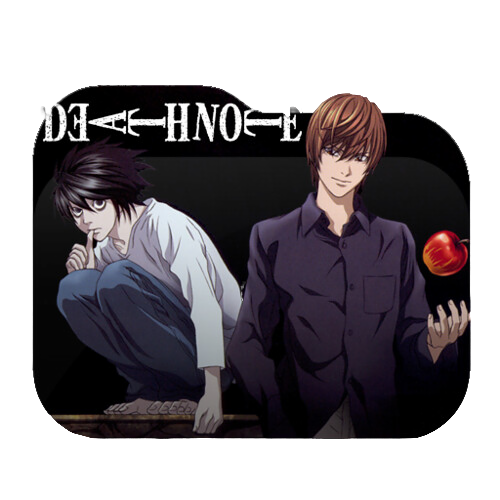
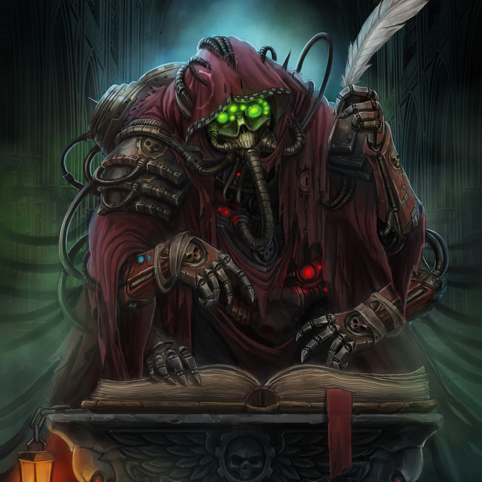
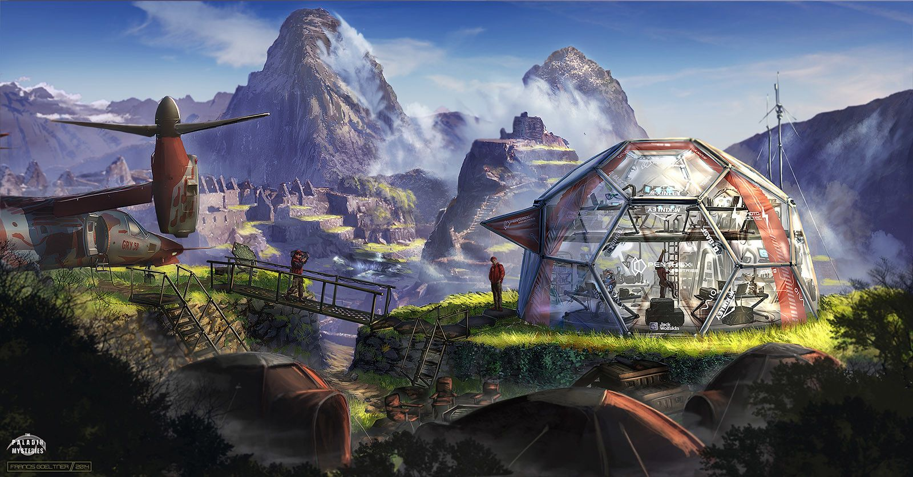

# Скил оптимальности: особенность  

## Проект "Тетрадь Смерти: Перелом"

В продолжение сериала "Тетрадь Смерти".

Программа для общения с Союзником: <a href="https://botogame.github.io/fracture/">https://botogame.github.io/fracture/</a>.

### Глава 1

Вспышка света. Ещё одна. Я вот уже десять земных лет наблюдаю за ним.

Не за убийцей. Не за спасителем. За человеком — искрой, что разгорается в темноте. Его улыбка, светлая и простая, зажигала сердца прохожих. Люди не могли объяснить, почему тянулись к нему. В нём не было ничего нарочитого. Но стоило взглянуть — и ты уже улыбаешься в ответ. Просторы воды, ветра и неба отзывались на его дыхание. Мир становился мягче. Он был тем, кто мог открыть дверь к нам — в сон, где правит не страх, а возможность.

И я ему помогу.

Но вокруг него — враги. Жадные, упрямые, слепые. Они не видят, что он делает не только для себя. Они хотят отнять. Запретить. Заблокировать. Он им мешает — не потому что опасен, а потому что свободен. А свобода всегда пугает.

Я — синигами. Но не тот, кого вы знали. Не Рюк. Не Рэм. Меня зовут Сарум, и я не приношу смерть — я приношу знание. Моя Тетрадь не для казни, а для снов. Для тех, кто способен видеть сквозь страх.

Первое, что я дал ему — было знание. Огонёк в его сознании. Я шепнул: «Береги. То, что тебе дано — не для чужих глаз. Это не оружие. Это суть. Храни её, как зеницу ока». Он кивнул, не спрашивая зачем.

Второе — урок. «Не держись за чужое. Всё приходит, всё уходит. Потерянное — не конец. Иногда, чтобы найти своё, надо отпустить то, что тебе никогда не принадлежало». Он понял. И отпустил. Болью, но понял.

А затем — дары.

Первая вещь, что я оторвал от сердца — сумка. Маленькая, потрёпанная временем, когда-то принадлежавшая женщине, что знала: её дом — не стены, а её вера в реальность. Он принял сумку. И с ней обрёл своё первое прибежище. Уют в хаосе. Ощущение, что ты не гость на этой земле.

Вторая — шлёпки. Принесённые с моря. От старого моряка, что ушёл за горизонт и не вернулся. Эти шлёпки — как след. Он надел их — и впервые пошёл в сторону, которую боялся. Не по асфальту, а по своей дороге. Дом теперь был с ним — в шаге, в пути, в странствиях.

--------------------------------------------------------

### Глава 2

Её звали Маро.

Она не искала человека. Она искала узел. Точку пересечения. Осколок смысла, застрявший в тканях повседневности.

Маро знала: наши предки не родились на этой планете.
Они прибыли издалека — с планет, где гравитация звенела иначе, а речь могла взламывать материю.
Они пришли не как завоеватели, а как беглецы — от чего-то, что не имело формы, но разрушало всё, что осмеливалось помнить.

И была война.

Космическая, не в лазерах — в структурах мышления. В навигации сна, в символах, что распадались от страха.

Человечество — их потомки. Не прямые. Изменённые, придавленные. Побеждённые.
Нам оставили кусочки, забытые в швах. В ритуалах. В обыденности.

Маро любила читать о вархаммере.
Не ради героев. Ради намёков.
Каждая фраза, каждый образ — код, маскирующий воспоминания.
Она собирала эти крошки, как старые карты звёздных дорог.
И однажды во сне она попала туда, где гравитация звучала как музыка.

То место повторялось. Неназванный холм. Город, которого нет.
И среди зданий — дом, построенный, казалось, не руками, а памятью.
Она поняла — это не просто сон. Это перекрёсток, где время согнуто в кольцо.
И если найти того, кто носит ключ — можно войти. Остаться.

Он появился днём, в простом свитшоте и спортивных штанах.
Но ткань на нём была странной.
Ворс не отражал свет. Швы будто меняли направление при взгляде.
Воздух рядом был легче, как перед грозой.

Маро заметила его.
Её глаза не искали красоту — они искали аномалию в узоре.

"Одежда на нём не современная. Не в модном смысле.
Она — пережиток.
Остаток формы, в которой когда-то... летали."

Это был облачный слой, как его называли древние.
Униформа не солдата, а пилота снов.
Материя, прошитая не только нитями, но памятью о невесомости, о резонансе с кораблём, о навигации сквозь сон.

Теперь это выглядело как домашний костюм. Но в ткань была вшита карта, не в географическом смысле, а как маршрут к забытому пространству.

Она села рядом. Не спросила, как его зовут.
Просто сказала:

— Ты не чувствуешь, что в твоей одежде что-то ещё?
Он замер. Потрогал рукав.

— Всегда было ощущение, будто она меня знает. Как будто я не покупал её, а...

— Получил, — закончила она. — Давно. Не здесь.

Он кивнул. Его глаза стали глубже, как будто вспомнили воздух без гравитации.

И тогда я, Сарум, передал третий дар.
Не книгу. Не артефакт.
А вещь, которую он и так носил на себе каждый день.

Потому что самые мощные дары — те, что кажутся обыденными.

Эта одежда — больше, чем защита от холода.
Она — канал.
Тонкая оболочка, что однажды защитила первого беглеца,
И теперь — пробудит последнего.

---------------------------------------

### Глава 3

Враги не всегда выглядят как чудовища.

Иногда — это забывчивость.
Иногда — ощущение, что ты просто устал.
Что смысла нет. Что ты — один.
Это не твоё. Это оно.

Они называли его Нечто.

Имя дали задним числом, когда было уже поздно.
Когда города начали рушиться не от войн, а от внутренней эрозии смыслов.

Нечто было не из материи. Оно не нападало напрямую.
Оно действовало сквозь сон.
Через трещины в памяти, через размывание различий между "было" и "не было".

Сначала предки замечали, как исчезают детали.
Мелочи: имя матери, запах планеты в утреннем воздухе, маршрут к родному дому.
Потом — профессии.
Потом — язык.

А когда они забыли кто они, тела начали меняться.
Они теряли материализацию.
Болезни, которые не знали до этого, стали повсеместными.
Иммунитет, основанный на сознательном сновидении, распадался.

— Ты должен понять: Эти люди создавали себя через сон. Каждую ночь они входили в архетипические конструкции, где прорабатывали свою форму, свою душу, свой разум. Сон был мастерской. А Нечто — выжигало эту мастерскую до основания.

Они знали: у них осталась последняя попытка.
Не оружие. Не бегство.
А память.
И тогда был построен Он.

Компьютер. Но не в привычном понимании.

Инерциальный Ядрохранитель, спроектированный не в физике, а в онтосне — метапространстве, где идеи плотнее материи.

Методика хранения информации была такой:

<b>Стабильный Сон-Шаблон (СШШ)</b>
Они находили во снах образы, устойчивые к разрушению. Символы, что переживали любые искажения.
Это были: лестница без верха, тёмный поезд, зеркало без отражения, голос матери, дверь без ручки.
Эти образы не просто повторялись — они сопротивлялись изменению. Именно в них и вшивали данные.

<b>Резонансная Закладка (РЗ)</b>
Каждая единица информации кодировалась через эмоциональную насыщенность.
Например, имя предка хранилось не как текст, а как ощущение его присутствия в момент выбора между жизнью и смертью.
Чем сильнее эмоция, тем устойчивее блок.

<b>Мнемонический Контейнер (МК)</b>
Это были люди.
Их тренировали так, чтобы их мозг во сне был магнитным носителем.
Они не знали, что несут в себе данные — иначе враг почувствовал бы.
Но стоило попасть в нужный сон, в нужное место — и контейнер активировался.

Этот "компьютер" не стоял в здании.
Он жил в людях, в их снах.
Он рассеялся по планете, по поколениям.

Это было последнее, что они сделали всеми оставшимися силами.
Они вложили в сон не просто знания —
а память о том, как помнить.

Я, Сарум, знал — один из таких контейнеров активируется.
Он уже начал видеть холм. Дом. Женщину, что ждёт.
А с ней — ключ к следующему уровню сна.

Но и Нечто почувствовало пробуждение.
Оно снова двинулось.
Не через войну. Через сомнение.

И в этой игре осталась последняя фигура,
Которая ещё не знает,
что она — главная.

----------------------------------------

### Глава 4

Когда казалось, что человечество спасено —
когда инерционный компьютер-хранитель снов распределил своё зерно по поколениям —
когда первые пробуждённые начали возвращать забытые символы,
Нечто нашло ход, которого не ждали даже предки.

Оно вошло внутрь самого сна.
Не разрушая.
Не взламывая.
А — подражая.

Первым, что оно изучило, была форма человеческой воли.
И там, в самом центре воли, оно нашло упрямство.

Упрямство — это не сила.
Это замороженная воля, которая забыла, куда шла, но продолжает двигаться.

Это отказ услышать.
Это «я сам знаю».
Это «не лезь ко мне, я прав».
Это броня, которую человек надевает, даже если сам уже умирает внутри.

Нечто создало зерно упрямства — тонкое, почти незаметное.
Оно внедрялось во сне: через "своё мнение", "свою правду", "свою реальность".

Пробуждённый человек во сне вдруг начинал говорить:

— Я уже знаю, не мешай.

— Это чушь, я сам решу.

— Всё это бред, я не верю в ваши символы.

Всё ещё во сне.
Но он уже не принимал помощь.

И вот тогда Нечто получило армию.

Людей, что верили, что они сами всё поняли.
Что проснулись — но лишь в ложном пробуждении.
Во сне, где они были богами, а все остальные — враги.
Где каждый держал свою истину как оружие.
И, самое страшное — шел воевать с другими пробуждёнными.

Сопротивление увидело, что теряет своих.
Не через смерть. Через изоляцию.
Люди больше не верили друг другу.
Не чувствовали общее.
Они строили стены в тех самых снах, которые раньше были мостами.

Они называли это:
Осквернение Сердцевины.
Когда внутри сна человек закрывался от истины, думая, что её достиг.

Сарум записал это в Тетрадь Сна:

"Упрямство — это тьма, которая называет себя светом.
Оно не разрушает — оно удерживает.
Не бьёт — но не отпускает.

И если страх можно победить знанием,
То упрямство побеждается только одним:
внутренней честностью.

Но кто готов быть честным в мире, где каждый — прав?"

Но был один человек.
Он ещё не знал,
Что именно его сомнение в себе
станет первым ударом по упрямству.

Он — тот, кто увидел женщину из сна.
Она читала Вархаммер и верила что была древняя война.
Она хранила фрагмент костюма, который был больше, чем одежда.
И она — ждала его.

И их встреча всё изменила.
Но и Нечто...
уже шло за ними.

---------------------------------

### Глава 5

Нечто укрепляло позиции.
Упрямство расползалось, как лёд по стеклу.
Люди спорили во сне, как враги,
строили крепости из своих правд
и забывали, что однажды уже почти исчезли.

Но спасение пришло — не из ума,
а из памяти тела.

Первыми были странники.
Те, кто ещё помнили сны до упрямства.
Они стали замечать,
что самые стойкие к искажению были те,
кто носил чужое.
Кто брал поношенные вещи, подаренные с любовью —
и продолжал путь в них.

Пальто от матери.
Рубашка друга, ушедшего в первый сон.
Шарф, оставленный кем-то у костра.

Эти вещи хранили след.

След воли.
След мечты.
След боли, пережитой и принятой.

Вещь, отданная искренне,
несла в себе отпечаток честности,
а честность — враг упрямству.

Люди начали делиться одеждой.
Не как подаянием —
а как обрядом сопричастности.

Каждая переданная вещь была как живая строчка из сна.
Как фрагмент забытой карты.
В ней была душа, не в метафоре — по-настоящему.

Это было давно.
Так давно, что нынешние сны уже не помнили их лиц,
а только отблеск тепла в тканях, передаваемых из рук в руки.

Он встретил её среди руин старого города.
Город тогда ещё знал имя своей реки,
но уже начал забывать небо.
Она дрожала от холода,
а он снял с себя старый вязаный свитер,
пахнущий солью, дорогой и кострами.

Надев его, она вдруг узнала,
как строить убежище во сне,
как укрывать не только себя,
но и других —
словами, теплом, вниманием.

И позже, когда он сам начал терять ориентиры,
когда упрямство едва не заперло его в кольце собственных мыслей,
она отдала ему своё пальто.
В нём была нить из её детства,
память о том, как пахнет весенний воздух до дождя,
и как прощают без слов.

Он надел его — и вспомнил, как не бояться.
Вспомнил себя.

Упрямство ослабевало.
Не выдерживало связи.
Оно не могло удержаться в потоке, где одно "я" становилось "мы".

Нечто завизжало.
Оно чувствовало, как трескается корка его влияния.
И тогда — оно ушло вглубь.

Его верные последователи,
связанные упрямством, как тенью на сердце,
начали отступать —
вглубь гор,
под землю,
в тоннели, где не слышно снов.

Там, в темноте,
они стали строить Улей Возврата —
место, где упрямство можно будет взрастить вновь,
не как вирус,
а как бога.

Но мир уже начал меняться.

Поношенные вещи стали ключами.
Люди обменивались одеждой,
и вместе с материей передавали часть себя.

Одежда стала хранилищем памяти,
простой и ясной:
«Ты не один».
«Я прошёл это».
«И ты пройдёшь».

Сарум записал:

«Вещи, которые носим, — это не просто материал.
Это оболочка воли.
Одежда, напитанная любовью,
не только согревает тело —
она лечит душу от одиночества.

И даже если ты не знаешь, чья она была —
если тебе её дали,
ты уже не один.

И это значит:
Упрямство отступит.»

Сейчас же Нечто встрепянулось — конец близок.
Он и Маро нашли нужные вещи, они наладили курс до своего дома.

Оно больше не могло ждать.

"Беспамятство надежды" —
последнее, самое страшное, что у Нечто осталось.
Оно не просто стирало память.
Оно размывало пульс самого дома.
Уничтожало следы, где когда-то ступала любовь.
Очищало полки от запахов.
Лишало стены эха голосов.
Поглощало даже свет.

Этот дом был не просто укрытием.
Он был их первым местом встречи.
Где не нужно было слов.
Где тишина между ними значила больше, чем любые клятвы.

Теперь же дом трещал.
Словно забывал сам себя.
Как будто и не существовал никогда.
Так действует "беспамятство надежды" — оно не разрушает. Оно убеждает, что ничего не было.
Что никакой дом не стоил сохранения.
Что никакой смысл не стоит боли памяти.

Тёплая лампа, что когда-то освещала сон Маро.
Крючок у двери, на котором висел его свитер.
Половица, что всегда скрипела — как напоминание: ты дома.

Теперь всё это — начинало исчезать.

Но они не отступили.
Потому что дом — не стены.
Потому что память — не в голове, а в руках,
в взгляде, в одежде, переданной однажды.

Они знали:
не надо бороться с беспамятством.
Надо вспомнить вслух.
Вдвоём. Мы были там, вместе.

### Глава 6

Туман неизвестности окутывал всё вокруг, густой и бескрайний, словно бездонная бездна, где не было ни звука, ни света. В этом тумане Маро и он стояли у порога дома, который постепенно растворялся в бескрайней серой мгле. Свет лампы мерцал, будто борясь с нарастающей пеленой, усталый от долгой и безуспешной борьбы.

— Дом уходит, — прошептала она, касаясь стены, что уже не отвечала на прикосновения.

— Я не обещаю, что будет легко, — ответил он, глядя ей в глаза. — Но я обещаю, что ни шагу не сделаю без тебя. Мы пройдём через это вместе, и я сохраню тебя, даже если придётся отдать за это всё. Ты — не просто часть этой истории, ты — смысл моего существования. Если ты доверишь мне свою жизнь, я защищу её, как свою собственную.

Маро взглянула на него, и в её глазах вспыхнул огонь доверия. Медленно она сняла с себя то, чему никогда бы не доверила никому — свои трусы — и протянула ему.

— Это — символ надежды и силы, — сказала она тихо. — Снятие этого знака разрушит тьму, что порабощает наш дом. Этот жест — не просто дар, а оружие против Нечто, что пытается уничтожить нас.

Он взял этот символ, и в тот же миг тьма начала отступать. Нечто, что рычало и пыталось держать их в плену, сжалось и рассеялось под силой этого простого, но мощного акта.

Дом стал крепче, стены оживали, лампа загоралась ярче. Память возвращалась, наполняя пространство светом и жизнью.

— Нечто уничтожено, — прошептал он, чувствуя, как в их руках теперь — будущее.

— Вместе, несмотря ни на что, — сказала Маро, мягко улыбаясь сквозь тьму. — Пока мы рядом, никакая тьма не сможет разлучить нас.

Он взял её за руку, и вместе они вошли в дом, который уже не мог забыть себя.

Потому что дом — это мы.

Память — это мы.

И даже в самой тьме есть сила, способная её уничтожить.

