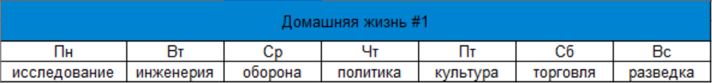
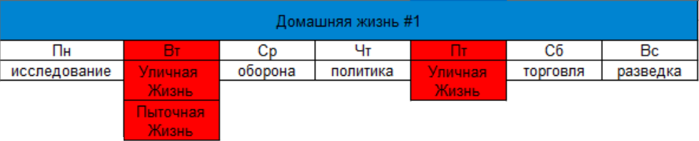
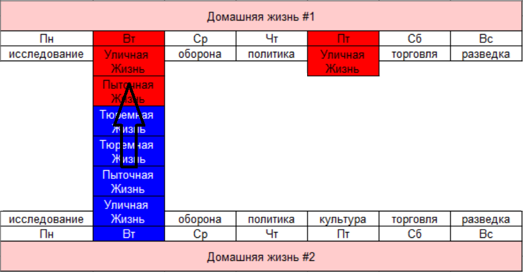
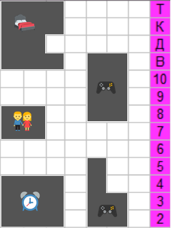
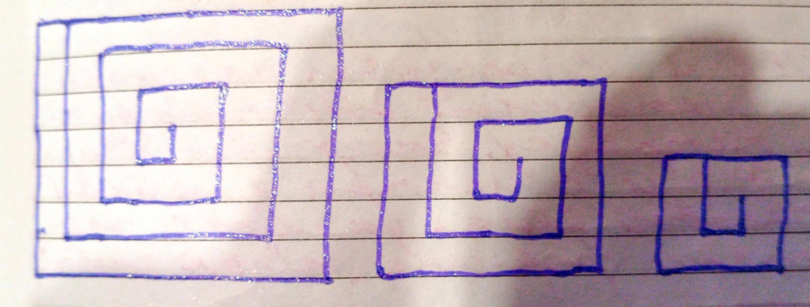
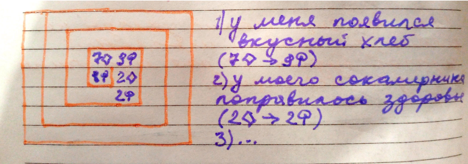
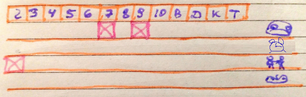
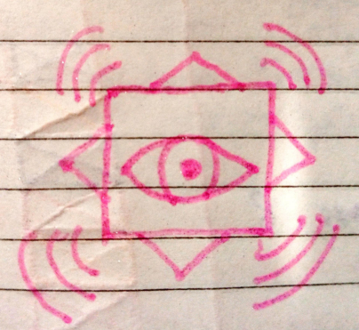

# Скил деликатности: бронирование

## Проект "Катализатор мечты"

### Пещера

Она была пуста, за исключением двух предметов — стола по центру комнаты и странного устройства на нём, которое пульсировало мягким светом, едва освещая стены. Туда вошёл мужчина, назовём его первым. Он посмотрел на устройство, нервно скрестив руки на груди. Ему предстояло сделать выбор, который изменит судьбы многих, хотя пока он и сам не осознавал, насколько велико его влияние.

Устройство которое было перед ним называли Катализатором Мечты. И это был не просто прибор, а нечто живое, соединённое с разумом людей, чьи мечты и желания о свободе от мира, правил и ограничений давали ему силу. Но никто до конца не понимал, как устройство работает, и уж тем более, к чему это может привести.

В комнату вошла женщина, её лицо было скрыто тенью капюшона. Она медленно подошла к устройству и, не говоря ни слова, взглянула на мерцающий экран.

— Ты знаешь, что это не случайно? — спросила она тихо. — Они сами сделали свой выбор.

— Выбор? — горько рассмеялся первый. — Разве это был их выбор? Они просто не знали, что происходит за границами их сознания. Катализатор взял всё, что у них было, и изменил их миры так, что они уже не могут вернуться.

Женщина в капюшоне посмотрела на него с пониманием, но не с сочувствием.

— Они не смогут выбраться, пока не поймут главное: истинная свобода не в возможности творить, что пожелаешь, а в умении не потеряться в собственных желаниях.

С этими словами женщина в капюшоне протянула руку к устройству и набрала цепочку событий из пасьянса Медичи. Комната заполнилась резким звуком, и экраны мигнули. Внезапно устройство перестало пульсировать, и свет в комнате угас.

Наступила полная темнота.

<hr>

### Потемки

Непреодолимая сила и мощь в нашем мире представлена в виде стихий. В игральных картах это масти, где:

| Масти  | Олицетворение |
| ------------- | ------------- |
| ♡  | вода |
| ♤  | воздух  |
| ♧  | землю  |
| ♢ | огонь  |

Стихии могут как разрушать города, так и вскипятить чайник, в зависимости от уровней изъятия. В игральных картах это номиналы, где:

| Номинал  | Уровень |
| ------------- | ------------- |
| `2`  | второй уровень  |
| `10`  | десятый  |
| `В`  | одиннадцатый  |
| `Т` | четырнадцатый  |
| ... |   |

Чем больше уровень изъятия стихии, тем адекватней социум вашего города и быстрее ближайшая местность вашего города может для вас сменить реальность.

При сбое какого то уровня - большие уровни тоже могут сбоить или прекратить свою работу. Защита от сбоев была придумана в виде режимов обогащения:


| Обогащение  | Защита |
| ------------- | ------------- |
| лаконичное  | 46-100% защиты  |
| фанатическое  |  36-45% |
| педантичное  | 21-35%  |
| эстетичное  | 11-20%  |
| паханское  | 1-10%  |
| изящное  | 0% как реконструкция  |
| отзывчивое  |  отрицательный % самопожертвования |

Обычно режимы обогащения завязаны на возрастной период нашего тела:


| Обогащение  | Возраст |
| ------------- | ------------- |
| отзывчивость  |  0-4 лет |
| изящество  |  5-6 |
| паханство  |  7-15 |
| эстетика  |  16-25 |
| педантичность  |  26-28 |
| фанатизм  | 29-30  |
| лаконичность  | от 31   |

Ритмы обогащения примерно такие:

<details>
<summary><ins>Отзывчивость (пародия на Дискотеку аварию)</ins></summary>

 ```
Смех-смех, как это мило
Смех-смех по причине
Особые гости у нас для вас
Развеселят вашу обстановку в раз

А когда вам на самом деле станет веселее
Если вы конечно не будете заняты другим
Вы целым цехом вздрогнете у себя там мигом
И позовёте сделать всё вот это нас на бис:

Смех-смех, как это мило
Смех-смех вы уж простите
И вот мы уже закончили наш рассказ
Чтобы разойтись нам с миром в раз
```

</details>

<details>
<summary><ins>Изящество (пародия на Эдиту Пьеху)</ins></summary>
 
```
Он хотел сбежать от меня
Он мальчишка ещё вроде
Наказать хотела я
А оказалась в его засаде

Сделал так что захотела я
То чего ещё на знала
По простому говоря
Я во всю в него запала

Там-там где не цвели ещё поля
Был он самым нежным и желанным
Там-там, где я хотела наказать
Оказался список удивительных желаний
```

</details>

<details>
<summary><ins>Паханство (пародия на Муслима Магомаева)</ins></summary>
 
```
Томная ночь
Ты лежишь напротив меня
Глубоко погружёна в себя
Обо мне ты мечтаешь

Томная ночь
Там где плохо уже нет там тебя
Знаешь меня нет тоже там
Так бывает

Томная ночь
Где рассвет нас встречает теплом
Чтобы согреть нас завтрашним днём
И ничего не раздражает
```


</details>

<details>
<summary><ins>Эстетика (пародия на Ва Банкъ)</ins></summary>
 
```
Власть! Я хочу Познать Власть!
Чтобы у кого нибудь отнять
То что никогда не принадлежало мне
Без какого нибудь разрешения

Власть! Я хочу Понять Власть!
Которая хочет изъять меня
Из моего же государства
За заработанные мной деньги

Власть! Кто из нас Власть
Когда нет у нас жены
Которая хотела бы выйти замуж
Чтобы поуправлять другими всласть
```

</details>

<details>
<summary><ins>Педантичность (пародия на Уматурман)</ins></summary>
 
```
Есть Антон Городецкий
Как то он зашёл в город соседский
Упырей мочить, зомбаков притеснять

Но случилась загвоздка
Встретил Настю Каменскую
Волкодава в погонах чтобы ему помешать

И началась  разбериха
Кто чей сын и чья дочь на районе
Имеют право вырвать волосы вклочь

Всё случилось бы плохо
Если не другая загвоздка
В такой суете потеряли они ключ

И не ели и не спали
Всё искали и искали
Зачем они встретились и почему
```

</details>

<details>
<summary><ins>Фанатизм (пародия на Грибы)</ins></summary>
 
```
Между нами превосходство
И никто нас не поймёт
Почему мы раньше не могли
Выйти из своего глупого одиночества

Но настанет новый день
Мы поймём куда идти
Чтобы навсегда нам позабыть
Как не нужны были друг другу

Соберём мы деньги дружно
И уедем навсегда
Там где всё это не нужно
Чтобы не пытались отобрать

А когда настанет скука
Позовём других друзей
Позабавимся мы с ними
И застелсимся от них
```

</details>

<details>
<summary><ins>Лаконичность (пародия на Лакосту)</ins></summary>
 
```
Будем делать новый мир
Как строитель кладёт кирпич
Так и мы найдём основу
Срастить которую сможем мы

И когда удивит свет
Что случилось у нас с тобой
Увековечат нас вовек
Как творцов небесной глади

И потери все уйдут
В пропасть тайною дорогой
Чтобы не вспомнили про нас
Ничего плохого в небе
```
</details>


У каждого режима обогащения разные назначения стихий:

| Обогащение  | ♡ | ♤ | ♧ | ♢ |
| ------------- | ------------- | ------------- | ------------- | ------------- |
| Отзывчивость  | осмотрительность  | осмысленность  | познавательность  | энтузиазм  |
| Изящество  | сюрреализм  | парадоксальность  | невинность  | замечательность  |
| Паханство  | поощрение  | рассудительность  | кокетство  | аргументирование  |
| Эстетика  | осторожность  | безжалостность  | устроенность  | занимательность  |
| Педантичность  | подсматривание  | абсолютность  | результативность  | координация  |
| Фанатство  | впечатление  | отстаивание  | привлекательность  | одобрение  |
| Лаконичность  | искренность  | предоставление  | дружелюбие  | внимательность  |

Названия стихий подбирались по такой формуле:

| Обогащение  | ♡ | ♤ | ♧ | ♢ |
| ------------- | ------------- | ------------- | ------------- | ------------- |
| Состоятельность  | счастье  | комфорт  | уют  | кайф  |

При этом, ♡ + ♤ = 🍒 очарование, ♢ + ♧ = ☢ единство.

<hr>

### Мрак

Наше время переменчиво и гарантом свободы для перемен является Год (мир).

У года есть четыре сезона, которые представляют сферы влияния. Назначения сфер влияний такие: 

| Сезон | Влияние |
| ------------- | ------------- |
| весна  | стратегия |
| лето  | восхищение  |
| осень  | вдохновение |
| зима  | прорицание  |


Вы наверно слышали выражение как "ветер перемен", в нашем же случае это надо понимать как "стратегию перемен".

У сезонов по три месяца, где каждый из них завязан на определенный вид деятельности, где их направления такие:

| Месяц  | Номинал | Направление |
| ------------- | ------------- | ------------- |
| март  | Т  | расположение  |
| апрель  | К  | позиционирование  |
| май  | Д  | маскировка  |
| июнь  | В  | блаженство  |
| июль  | 10  | озарение  |
| август  | 9  | посредственность  |
| сентябрь  | 8  | рациональность  |
| октябрь  | 7  | чистка  |
| ноябрь  | 6  | уединение  |
| декабрь  | 5  | прагматичность  |
| январь  | 4  | привязанность  |
| февраль  | 3  | выгода  |
| март  | 2  | празднование  |

Здесь Т и 2-ка смежные уровни, которые запитаны друг на друга в виде марта, как причина реальной смены старого года на новый. Возможно восьмого.

Особой фишкой новой методики будет ступенчатая переправа по сезонам года, где мы сможем перейти на нужную локацию с осуществлённой мечтой для вас.

Не мы служим месяцам, а они нам: от каждого месяца нам по возможности.

Ступенчатой переправой будет использование трёх социализирующих позиций:

| Позиция | Сокращенённо |
| --- | --- |
| запрос | з |
| предложение | п |
| реализация | р |


Схема переправы такая: 

|  |  |  |  |
|     :---:      |     :---:      |     :---:      |     :---:      |
| `Т` | п | р | з |
| п | `В` | з | р |
| р | з | `8` | п |
| з | р | п | `5` |
| `К` | п | р | з |
| п | `10` | з | р |
| р | з | `7` | п |
| з | р | п | `4` |
| `Д` | п | р | з |
| п | `9` | з | р |
| р | з | `6` | п |
| з | р | п | `3` |
| `2` | п | р | з |

В этой схеме переправу делаем по <b>п-р-з</b> и <b>з-р-п</b>, где прз это предложение реализованному запросу, а зрп это запрос реализованному предложению.

Переправы будут образовывать часть цепочки событий пасьянса Медичи, только ваша часть будет работать на вас (вашему желанию), за счёт бронирования.

Чтобы на переправах полностью исключить диссонансы нужно уравновесить количество использованных направлений на укладе. Например  (прз (1) = зрп (1)):

<b>Т → прз → К → зрп → 5</b>

Или чуть больше переправ (прз (2) = зрп (2)):

<b>8 → прз → В → прз → К → зрп → 10 → зрп → 9</b>

Черед использования переправ не важен, нужно их равнозначное количество по итогу.

Новую переправу начинаем с последней карты предыдущей переправы. При этом переправа должна переходить на другой номинал карты. И одинаковых карты (номинал + масть) в новом укладе тоже исключаем.

Масти карт при переправах такие:

| Пол | прз | зрп |
| --- | --- | --- |
| Мужчина | ♢ | ♤ |
| Женщина | ♡ | ♧ |

Например для мужчины:

<b>Т♢ → прз  → К♢→ зрп → 5♤</b>

Или кратче:

<b>Т♢ → К♢→ 5♤</b>

Где новый уклад:

<b>К♢→ 5♤</b>

Номиналы Т и 2-ку можно взаимозаменять. Например:

<b>Т♢ (считаем как 2) → Д♤→ 10♢</b>

<hr>

### Перезагрузка

Тьма длилась вечность. В ней не было ни звука, ни движения, ни даже намека на жизнь. Первый стоял неподвижно, чувствуя, как холод проникает в его мысли, вытесняя страх. Он знал, что не может остаться здесь надолго, но как выйти? Как найти свет?

— Ты знаешь, что делать, — голос женщины в капюшоне раздался из темноты, будто исходя отовсюду и ниоткуда одновременно. — Тьма — это не отсутствие света. Это твоя тень. Вопрос не в том, как выйти из неё, а как понять её природу.

— Я не понимаю... — пробормотал первый. — Как тьма может быть частью меня?

— Ты сам позволил ей взять контроль. Ты забыл, что изначально этот мир был твоим. Мечты и желания — это только инструменты. Свет здесь всегда был внутри тебя, ты просто перестал его видеть.

Эти слова эхом отозвались в голове. Первый сделал шаг вперёд, вслепую протягивая руки перед собой. Пальцы касались холодного воздуха, но ничего не находили. Он ощутил страх, как будто падал в бездонную пропасть, где не было опоры. В его сознании возникли образы прошлого: моменты, когда он ещё верил, что управляет своей судьбой, что мечты — это путь к свободе, а не тюрьма.

"Свет внутри..." — повторил он про себя, пытаясь ухватиться за эту мысль.

И тогда он закрыл глаза.

Во тьме, где зрение не могло помочь, он сосредоточился на своих ощущениях. Сначала он ничего не чувствовал, кроме тревоги, но постепенно, среди пустоты, появилась искра. Маленькая, едва уловимая, она была где-то глубоко внутри. Человек сосредоточился на этой искре, позволив ей расшириться, распространяя тепло по всему телу.

Внезапно внутри него что-то изменилось — не в окружающей тьме, а в нём самом. Он осознал, что эта искра всегда была частью его, но он позволил страху и сомнению затмить её. Когда он обратился к своим внутренним силам, мир вокруг начал меняться. Тьма стала отступать, уступая место слабому, но нарастающему свету.

Перед ним снова появилось устройство, Катализатор. Его экран был теперь тусклым, как будто больше не питался чужими мечтами. Женщина в капюшоне стояла рядом, на этот раз её лицо было видно: спокойное, с лёгкой улыбкой, как будто она всегда знала, что всё закончится именно так.

— Теперь ты понимаешь, — сказал она. — Свет не найдёшь, если будешь искать его снаружи. Вопрос не в том, чтобы избежать тьмы, а в том, чтобы принять её как часть себя. Тьма — это не враг. Она может стать твоей силой, если ты научишься управлять ею.

Первый понял. Мечты, которые создавал Катализатор, были отражением их хозяев. Люди создавали тюрьмы не потому, что желали этого, а потому что не знали, как управлять своими собственными страхами и желаниями. В поисках свободы они теряли себя.

Он сделал глубокий вдох и посмотрел на устройство. Оно больше не казалось таким страшным. Теперь это был просто инструмент, а не хозяин его разума.

— Мы можем начать всё сначала, — сказал он, посмотрев на свою спутницу. — Но на этот раз без иллюзий.

Женщина в капюшоне кивнула.

— Теперь ты готов, — сказал она. — И помни: свет во тьме всегда рядом, если ты готов его видеть.

Свет окончательно заполнил комнату, и больше не было ни страха, ни сомнений.

<hr>

### Пробуждение

Ключи к уровням изъятия обогащения такие:

| Номинал | ♡ | ♤ | ♧ | ♢ |
| --- | --- | --- | --- | --- |
| `Т` | спрятать | забронировать | укомплектовать | подобрать |
| `К` | уверить | чередовать | удивить | впечатлить |
| `Д` | оформить | проложить | ограничить | довести |
| `В` | обнадёжить | словить | утомить | обосновать |
| `10` | изменить | пропустить | свести | открыться |
| `9` | обласкать | принять | наладить | сконцентрировать |
| `8` | привлечь | предоставить | замять | настроить |
| `7` | устоять | уравновесить | избавить | обсудить |
| `6` | обсудить | настоять | дополнить | обеспечить |
| `5` | взвесить | предсказать | впитать | советовать |
| `4` | передать | удовлетворить | сдобрить | обрадовать |
| `3` | наполнить | раздать | оптизировать | наметить |
| `2` | разделить | подытожить | наделить | подвести |

Чтобы определить к какой игральной карте принадлежит ваше желание нужно пройтись по такой схеме отбора:

1) чья сфера влияния
2) чьё направление влияния
3) это нужда (зрп) или нужно внедрить (прз)


| чья сфера влияния? → | стратегия | восхищение | вдохновение | прорицание | чьё направление влияния? ↓ |
| :--- |     :---:      |     :---:      |     :---:      |     :---:      |      ---:      |
| | `Т` | п | р | з | расположение |
| | п | `В` | з | р | блаженство |
| | р | з | `8` | п | рациональность |
| | з | р | п | `5` | прагматичность |
| | `К` | п | р | з | позиционирование |
| | п | `10` | з | р | озарение |
| | р | з | `7` | п | чистка |
| | з | р | п | `4` | привязанность |
| | `Д` | п | р | з | маскировка |
| | п | `9` | з | р | посредственность |
| | р | з | `6` | п | уединение |
| | з | р | п | `3` | выгода |
| | `2` | п | р | з | празднование |

Переправу от одного номинала карты к другому нужно закреплять мантрами:

```
Я желаю своему катализатору мечты
{какого: такого то режима обогащения по масти}
{чего: чьего то ключа к уровню обогащения}
чтобы
{что то, что я желаю}
```

Например для 4♢ (лаконичность):

<b>Я желаю своему катализатору мечты внимательного обрадования, чтобы у меня было много денег.</b>

По началу нужно проработать себя изначальной мантрой "я желаю всем свободного удобства". Мантру нужно проговаривать (или про себя) до состояния эмпатии, когда "увидите" чёткий образ действий без сопротивления. В дальнейшем этот образ (проекция) реализуется сама собой посредством вас или кого то, если конечно никто не воспрепятствует, но это вы заметите.

Применяя ключи нужно закрепиться за режимом обогащения для лучшей вашей самоотдачи:

| Обогащение  | Эзотерика | + | Компьютеры |
| ------------- | ------------- | ------------- | ------------- |
| фанатизм  | книги  |  + | электронные часы  |
| лаконичность  | сладости  | +  | телефон  |
| отзывчивость  | таблетки  | +  | интернет  |
| изящество  | массаж  |  + | ноутбук  |
| паханство  | прогулки  |  + | онлайн игры  |
| эстетика  | художка  |  + | фильмы  |
| педантичность  | море  |  + | программирование  |

Чтобы заякориться вам потребуется (или предоставиться) партнёр противоположного пола. Через компьютеры мужчина (этот отдел для него) будет наполнять женщину, а женщина через эзотерику мужчину.

В правильных городах якоря это дни недели:


| День недели  | Обогащение | Проявление |
| ------------- | ------------- | ------------- |
| Понедельник  | изящество  | помощь |
| Вторник  | паханство  | поддержка |
| Среда  | эстетика  | декларации |
| Четверг  | педантичность  | парадоксы |
| Пятница  | фанатизм  | грамотность |
| Суббота  | лаконичность  | доступность |
| Воскресенье  | отзывчивость  | адаптации |

Правильность города можно определить по вашему самочувствию:

<b>1) правильный город = спокойно</b><br>
<b>2) не правильный = на суете, на сражениях, на измене</b>

Если выйти на планетарный режим, то город должен придерживаться влиянию таких планет по дням недели:

| День недели  | Планета | Обогащение |
| ------------- | ------------- | ------------- |
| Понедельник  |  Венера | изящество |
| Вторник  | Марс  | паханство |
| Среда  | Луна  | эстетика |
| Четверг  | Сатурн  | педантичность |
| Пятница  | Юпитер  | фанатизм |
| Суббота  | Меркурий  | лаконичность |
| Воскресенье  | Солнце  | отзывчивость |

Планеты пресыщают социум такими гильдиями:

| День недели  | Гильдия | Планета |
| ------------- | ------------- | ------------- |
| Понедельник  | Исследование | Венера  |
| Вторник  | Автоматизация | Марс  |
| Среда  | Автономность | Луна  |
| Четверг  | Политика | Сатурн  |
| Пятница  | Культура | Юпитер  |
| Суббота  | Торговля | Меркурий  |
| Воскресенье  | Разведка | Солнце  | 

По дате своего рождения вы можете понять для какой гильдии вы родились в своём городе (или от какого Бога-Богини вы можете всегда получить любую помощь за так).

Неделя сосредотачивается средой для удобства, где воскресенье → понедельник → вторник ( → среда) наполняют среду удачей для наглядности, а суббота → пятница → четверг  → ( → среда) наполняют среду успехом для простоты.

Выглядит это так:

| удача для наглядности | сосредочение для удобства | успех для простоты |
| ------------- | :---: | ------------- |
| <br><br>воскресенье → понедельник → вторник → | {месяц}<br>↑<br> → среда ← | <br><br> ← четверг ← пятница ← суббота | 

Через среду выходим на текущий месяц, при этом год всегда один (меняются только его версии = окончание декабря или смена вашей личной точки позиции). Но адекватно применять год в отношении себя, т.е. текущий месяц + 6 месяцев назад и 6 месяцев вперед. 

Например если сегодня август, то год это:


| прошлое года | позиция года | будущее года |
| ------------- | :---: | ------------- |
| фев → мар → апр → май → июн → июл → | → август ← | ← сен ← окт ← ноя ← дек ← янв ← фев | 
 
<hr>

### Свет

Делая уклады вы будете находиться или выходить на положение домашней жизни.

Всего положений жизни четыре:

| Уровень | Положение |
| ------------- | ------------- |
| 1. | домашнее |
| 2. | уличное |
| 3. | пыточное |
| 4. | тюремное |

Домашнее идёт как основа мироздания (все семь гильдий работают исправно):



Остальные положения идут как паразитарные со совсем не свойственной домашней жизни функциями:



Через паразитарные положения к вам может проникнуть чужая домашняя жизнь:



Чередуя режимы обогащения вы можете узнать где проблемные зоны у вашей домашней жизни и заякорившись на проблемной зоне совершить починку или стать частью паразитов, в случае облома.

Если нужно пройтись между положениями, то на каждом положении нужно стать хозяином с помощью таких состояний:


| Состояние  | Положение |
| ------------- | ------------- |
| свобода  | домашнее  |
| верность  | уличное  |
| разумность  | пыточное  |
| уверенность | тюремное  |

Все психоделики ставят на положение улицы и полезны для вызволения из пыточной и тюрьмы, в особенности аяхуаска (отрабатывает Т♡ для мужчин) и псилоцибин (Т♢ для женщин как наполнение). Иногда Т♡ только на женщинах срабатывает, а Т♢ на мужчинах, но это перевёртыши (вас психоделики распознали неправильно) и это очень опасно (вы перейдёте в особое состояние безумия и подтянете в "никуда" (этап расщепления) тех кто к вам был дорог), пересмотрите куда вы забрели и уходите немедленно в сторону спокойствия, любого.

При приёме психоделиков вы катастрафически лишаетесь положения дома (если оно было), но при окупации вашего дома это хорошая помощь чтобы отбить врага до положения пыточного, возможно не только своего, но и врага.

При  каждом создании уклада будет строиться ваша натальная карта судьба (как на ладонях рук). И чтобы в дальнейшем не потеряться в большом количестве укладов и иметь представление куда вы двигаетесь - нужно ввести привязку укладов к символам домашней жизни:


| Символ  | Судьба |
| ------------- | ------------- |
| 🛏  | отдых  |
| ⏰  | бизнес  |
| 👫  | отношения  |
| 🎮  | развлечения  |

С таким подходом у вас будет такая статистика:



Одна клетка - один уклад. По началу рост по горизонтали будет означать разнос лжи, а по вертикали - устранение преград.

Если есть уклады одного символа которые не соединены по вертикали (на примере это 🎮 на 6-ке и 7-ке), то такой уклад не адекватен (без жизненного сроста) и нужно внести уклады по отсутствующим номиналам (отработать долг).

Со временем (качественным) ваши уклады начнут идеально (а не поперёк) вписываться в матрицу мира образовывая квадратичные скрижали дополнения.

Выглядят они так:



Если вы ещё такие уклады не делали, то первой игральной картой будет 8♤ для мужчины и 8♧ для женщины.

<hr>

### Осознание 

Для работы с методикой достаточно ручки и листка бумаги. Вычерчиваем квадрат 7х7 и с центра змейкой по часовой делаем уклады с желаниями формата "желаю чтобы ...":



По мере заполнения фиксировать символы домашней жизни чтобы исключить долги:



Если под конец был не срост на символах домашней жизни, то нужно увеличить матрицу до 9х9 и дозаполнять её.

По факту готовности матрицы можно дорисовывать восьмиконечную звезду как символ постоянства, внутри по центру дорисовать глаз как символ надзора, а вокруг по три линии на четырёх внешних углах как символ безмятежности. Получится БДИ-лка (Бери Добро Истины) выполнения желания:



Как я когда то словил информацию - это схема устройства преодолевающее гравитацию.

На вид коробочка из золота. Когда поворачиваешь до восьмиконечной звезды по центру открывается вид на алмаз с которым можно общаться и просить всё необходимое от окружающей материи.

<hr>

### Растворение

Первый составил свою первую цепочку пасьянса Медичи и ввёл её в катализатор. Внезапно всё вокруг исчезло, включая скальные стены, устройство и женщину в капюшоне. Реальность ускользала, но первый не испытывал страха. Он почувствовал лёгкость и отпустил все свои прежние заботы и страхи, позволив себе раствориться вместе с окружающим миром.

Его тело и границы исчезли, и он ощутил себя частью бесконечной энергии. Он стал ветром, светом и тенью, существуя везде и нигде одновременно. В этом новом состоянии не было мыслей или ощущения "я". Он стал частью чего-то великого и бесформенного, где не было страха или страданий, а тьма и свет слились воедино.

Растворяясь в неизвестности, он не исчезал, а становился частью всего. Его сознание соединялось с другими, кто также искал свободу и боролся с иллюзиями. Теперь они были заодно, и их прежние желания и страхи больше не имели значения. Первый нашёл истинную свободу, растворившись в сущности бытия и став частью бесконечного потока времени и света.
