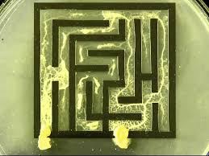

# Скил деликатности: распределение 

## Проект "Пасьянс Медичи. Бдилка"

Опубликована книга (там же запущен самостоятельный поток осознания): <a href="https://www.litres.ru/book/andrey-volkov-33168547/pasyans-medichi-bdilka-71113513/" target="_blank"> Книга на litres.ru</a>.

Технология, что изложена в книге, срисована с методиками работы слизевика.

- Онлайн приложение: <a href="https://botogame.github.io/vigil/">https://botogame.github.io/vigil/</a> (на айфонах скорее всего не работает - покупайте дешевый планшет)

- Телеграм для поддержки и направления: <a href="https://t.me/+pray5RL3J3UyYTQy">t.me/pm_bdilka</a>

- Youtube канал: <a href="https://www.youtube.com/@pm_bdilka">https://www.youtube.com/@pm_bdilka</a>

<ins>Методичка для работы с приложением</ins>

 Ввод мечты:
 
1. Выбор пола: вы можете для новой мечты выбрать противоположный пол например чтобы спиздить артефакт симулировав артефакту (не вы выбираете артефакт, а артефакт выбирает и идет к вам) свойственный и нужный ему пол.

2. Последняя карта: если вы впервые или вы опять начали с чистого листа (удалили несобранные в квадратуру уклады) - выставляйте 8.

3. Мечтаю чтобы: используйте конструкцию "[мечтаю чтобы] у всех был социализирующий уклад что [я такой то]". Ваша мечта будет накладываться на карты от 2 до Туза, то есть обойдет все месяцы - предстанет перед Годом.

4. Выбор сферы влияния и направления влияния: перебирайте названия и по наитию ищите "врага" или уязвимое место. Чем точнее вычислите лазейку, тем тише хакните мир. Ну то есть нашли поломку - починили со своими условиями, внедрив мечту на реализацию, а мир доволен что починили.

5. Выбор типа необходимости: если создаете для себя и хотите плодов - то нужда, если вторгаетесь к кому то и забыли - внедрение.

6. Мечтаю для: это не относится к мечте, вы пишите аргумент для "старших арканов" (дней недели) почему вы доебались до Года, ну то есть пишите какое благо будет для мира. От этого в дальнейшем будет зависить дальнейшее развитие событий (текущий день недели может посчитать что ваше желание надо передать другому дню недели, что и включит в цепочку событий).

7. Если у вас получилось так, что расклад не создается по причине сходства с последней картой предыдущего уклада - меняйте направление влияния на рядом стоящее.

Стадия после чтения мантр:

1. Выбор характеристики уклада: определяете написанное "мечтаю для" к чему лучше всего подходит в совокупности вашего изменения (после прочтения всех мантр). По честному только, ну, используя свое наитие конечно же.

2. Желательно повторить ввод мечты еще три раза на другие конечные карты, которые ближе подходят по уязвимостям у 4-х стихий.

